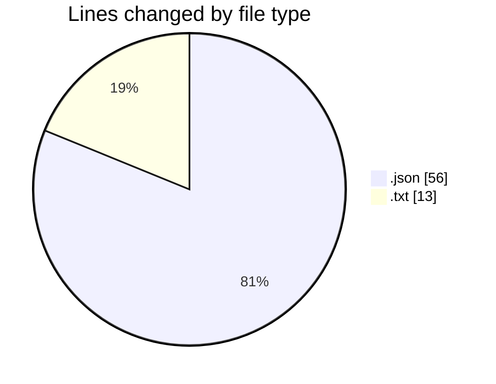
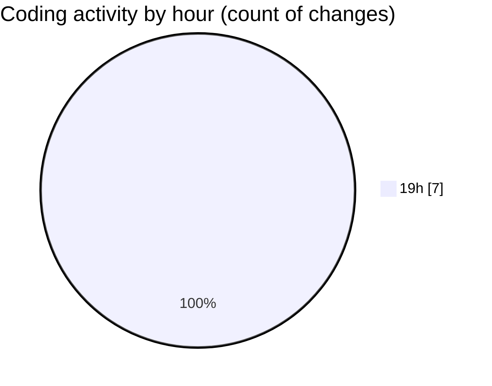

# echo - Activity Summary 

## Overall Statistics

| Stat                   | Value                                                             |
| ---------------------- | ----------------------------------------------------------------- |
| **Lines Added** (➕)   | 65                                          |
| **Lines Removed** (➖) | 4                                        |
| **Net Change** (↕)    | 61                |
| **Active Time** (⌚)   | 10 minutes |

## Modified Files
- **launch.json** (+20, -4)
- **tasks.json** (+32, -0)
- **CMakeLists.txt** (+13, -0)

## Visualizations

### By File Type (Lines Changed)

### By Hour (Estimated Activity Count)

> **Last Updated:** 3/19/2025, 7:54:39 PM