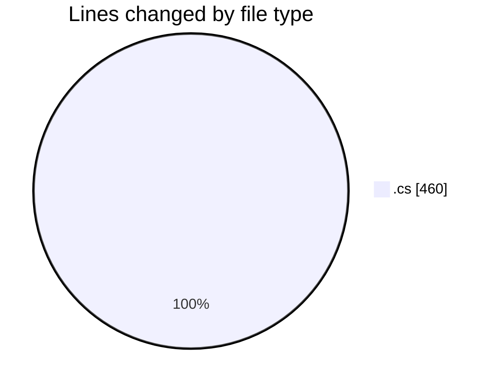
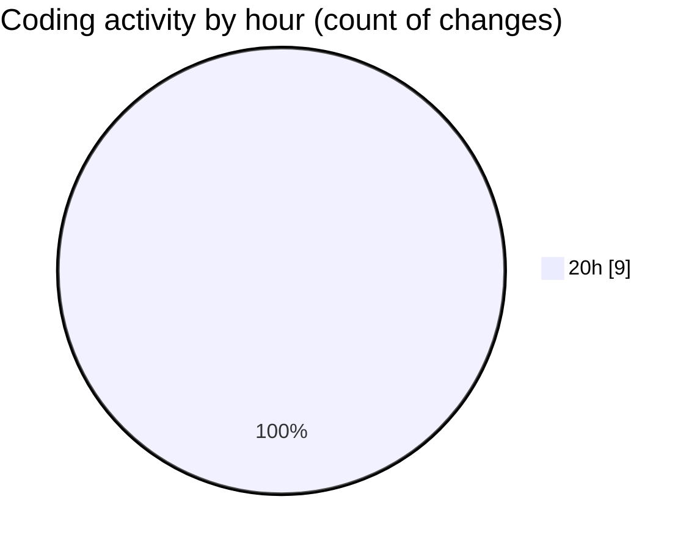

# Back-end - Activity Summary 

## Overall Statistics

| Stat                   | Value                                                             |
| ---------------------- | ----------------------------------------------------------------- |
| **Lines Added** (➕)   | 459                                          |
| **Lines Removed** (➖) | 1                                        |
| **Net Change** (↕)    | 458                |
| **Active Time** (⌚)   | 27 minutes |

## Modified Files
- **SecurityHeadersMiddleware.cs** (+65, -1)
- **HtmlSanitizerService.cs** (+13, -0)
- **Program.cs** (+178, -0)
- **UserService.cs** (+99, -0)
- **ReviewService.cs** (+78, -0)
- **InputSanitizerService.cs** (+13, -0)
- **InputSanitizationService.cs** (+13, -0)

## Visualizations

### By File Type (Lines Changed)

### By Hour (Estimated Activity Count)

> **Last Updated:** 3/25/2025, 8:28:42 PM