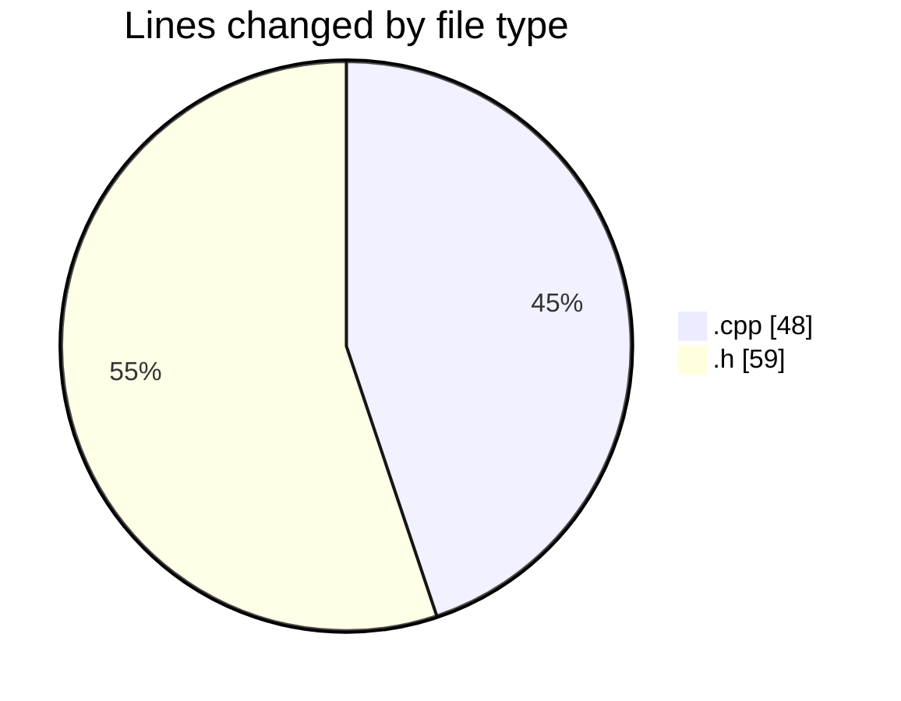
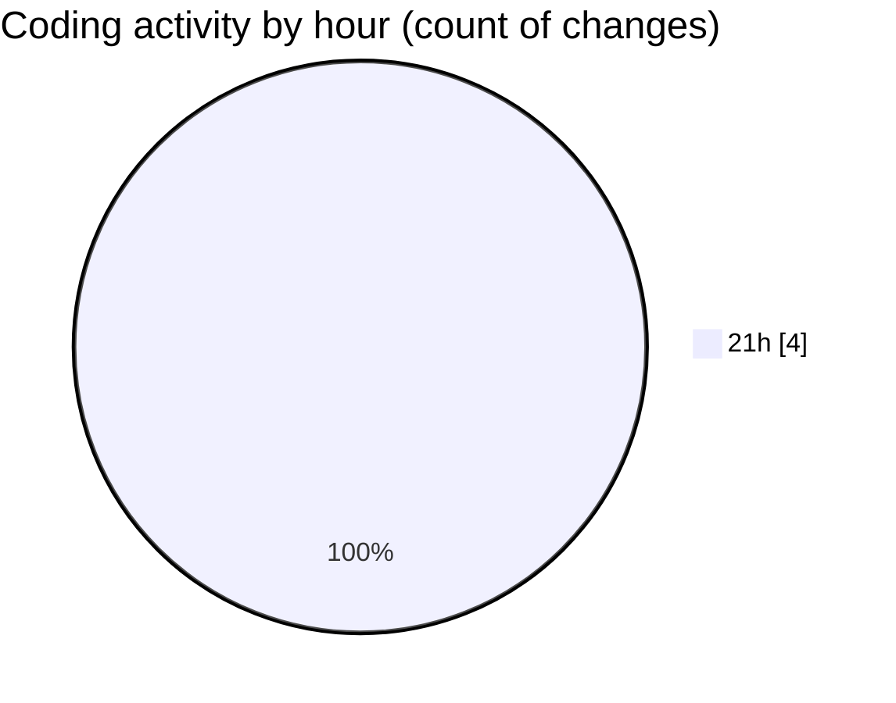

# juce_cmake_vscode_example (Workspace) - Activity Summary 

## Overall Statistics

| Stat                   | Value                                                             |
| ---------------------- | ----------------------------------------------------------------- |
| **Lines Added** (➕)   | 106                                          |
| **Lines Removed** (➖) | 1                                        |
| **Net Change** (↕)    | 105                |
| **Active Time** (⌚)   | 5 minutes |

## Modified Files
- **PluginEditor.cpp** (+47, -1)
- **PluginProcessor.h** (+59, -0)

## Visualizations

### By File Type (Lines Changed)

### By Hour (Estimated Activity Count)

> **Last Updated:** 3/25/2025, 9:33:21 PM