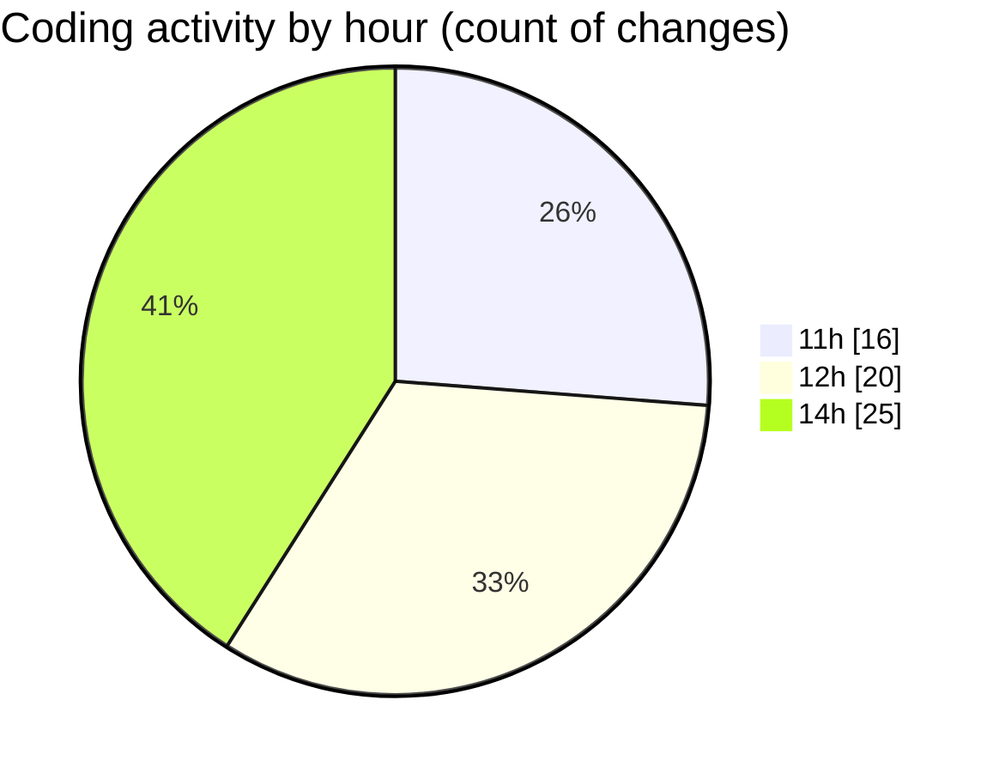

# Back-end - Activity Summary 

## Overall Statistics

| Stat                   | Value                                                             |
| ---------------------- | ----------------------------------------------------------------- |
| **Lines Added** (➕)   | 3715                                          |
| **Lines Removed** (➖) | 12                                        |
| **Net Change** (↕)    | 3703                |
| **Active Time** (⌚)   | 64 minutes |

## Modified Files
- **BasketControllerTests.cs** (+316, -0)
- **BasketController.cs** (+96, -0)
- **BasketService.cs** (+172, -0)
- **BasketDAO.cs** (+102, -4)
- **OrderControllerTests.cs** (+544, -0)
- **OrderController.cs** (+96, -0)
- **OrderService.cs** (+166, -0)
- **OrderDAO.cs** (+98, -0)
- **ReviewControllerTests.cs** (+274, -0)
- **ReviewController.cs** (+160, -0)
- **ReviewService.cs** (+152, -0)
- **ReviewDAO.cs** (+100, -0)
- **UserControllerTests.cs** (+181, -1)
- **AuthController.cs** (+210, -1)
- **LoginModel.cs** (+20, -2)
- **PromotionController.cs** (+27, -2)
- **User.cs** (+161, -1)
- **Program.cs** (+176, -0)
- **AbstractController.cs** (+129, -1)
- **AbstractService.cs** (+118, -0)
- **AbstractDAO.cs** (+105, -0)
- **ProductService.cs** (+82, -0)
- **PromotionService.cs** (+95, -0)
- **UserController.cs** (+23, -0)
- **UserDAO.cs** (+19, -0)
- **UserService.cs** (+93, -0)

## Visualizations

### By File Type (Lines Changed)

### By Hour (Estimated Activity Count)

> **Last Updated:** 3/26/2025, 2:54:30 PM