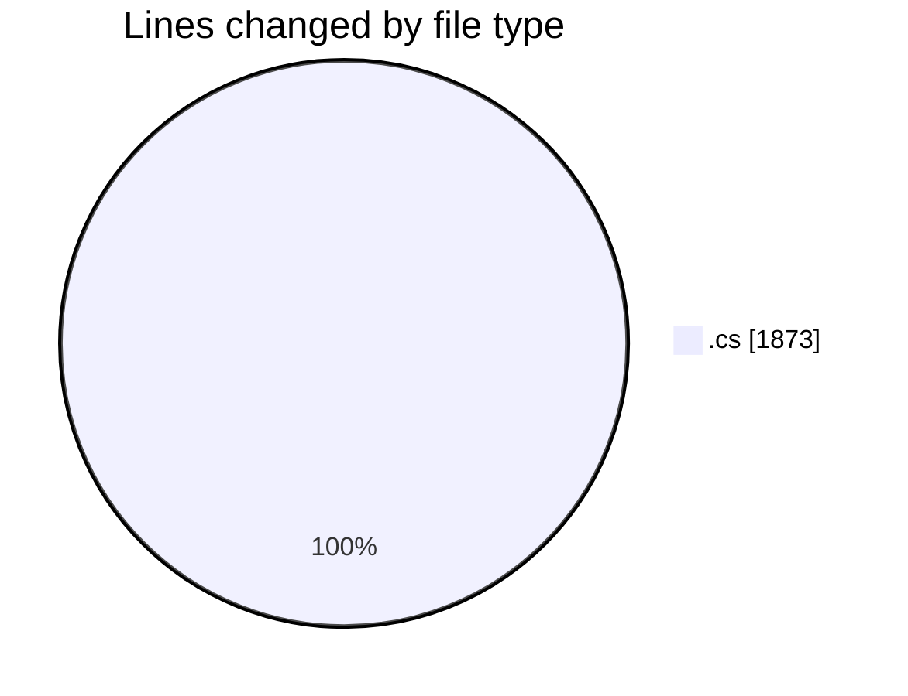
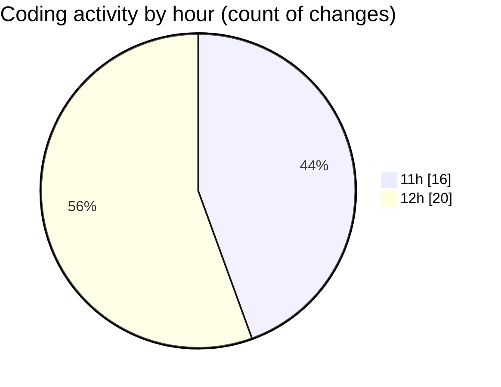

# Back-end - Activity Summary 

## Overall Statistics

| Stat                   | Value                                                             |
| ---------------------- | ----------------------------------------------------------------- |
| **Lines Added** (➕)   | 1863                                          |
| **Lines Removed** (➖) | 10                                        |
| **Net Change** (↕)    | 1853                |
| **Active Time** (⌚)   | 39 minutes |

## Modified Files
- **BasketControllerTests.cs** (+316, -0)
- **BasketController.cs** (+48, -0)
- **BasketService.cs** (+86, -0)
- **BasketDAO.cs** (+53, -4)
- **OrderControllerTests.cs** (+272, -0)
- **OrderController.cs** (+48, -0)
- **OrderService.cs** (+83, -0)
- **OrderDAO.cs** (+49, -0)
- **ReviewControllerTests.cs** (+274, -0)
- **ReviewController.cs** (+80, -0)
- **ReviewService.cs** (+76, -0)
- **ReviewDAO.cs** (+50, -0)
- **UserControllerTests.cs** (+91, -1)
- **AuthController.cs** (+210, -1)
- **LoginModel.cs** (+20, -2)
- **PromotionController.cs** (+27, -2)
- **User.cs** (+80, -0)

## Visualizations

### By File Type (Lines Changed)

### By Hour (Estimated Activity Count)

> **Last Updated:** 3/26/2025, 12:45:09 PM