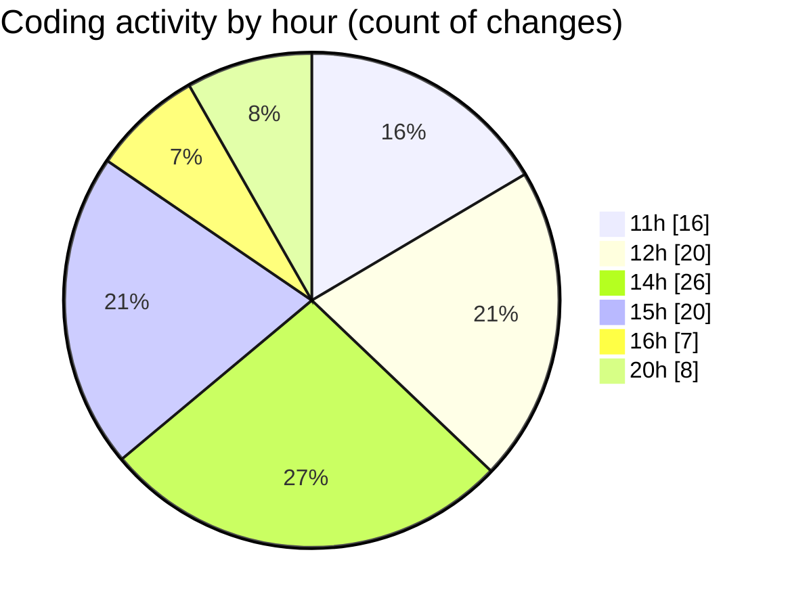

# Back-end - Activity Summary 

## Overall Statistics

| Stat                   | Value                                                             |
| ---------------------- | ----------------------------------------------------------------- |
| **Lines Added** (➕)   | 4842                                          |
| **Lines Removed** (➖) | 21                                        |
| **Net Change** (↕)    | 4821                |
| **Active Time** (⌚)   | 103 minutes |

## Modified Files
- **BasketControllerTests.cs** (+316, -0)
- **BasketController.cs** (+144, -0)
- **BasketService.cs** (+258, -0)
- **BasketDAO.cs** (+151, -4)
- **OrderControllerTests.cs** (+544, -0)
- **OrderController.cs** (+144, -0)
- **OrderService.cs** (+249, -0)
- **OrderDAO.cs** (+98, -0)
- **ReviewControllerTests.cs** (+274, -0)
- **ReviewController.cs** (+160, -0)
- **ReviewService.cs** (+152, -0)
- **ReviewDAO.cs** (+150, -0)
- **UserControllerTests.cs** (+182, -1)
- **AuthController.cs** (+210, -1)
- **LoginModel.cs** (+20, -2)
- **PromotionController.cs** (+27, -2)
- **User.cs** (+325, -5)
- **Program.cs** (+353, -1)
- **AbstractController.cs** (+258, -2)
- **AbstractService.cs** (+118, -0)
- **AbstractDAO.cs** (+105, -0)
- **ProductService.cs** (+82, -0)
- **PromotionService.cs** (+95, -0)
- **UserController.cs** (+23, -0)
- **UserDAO.cs** (+38, -0)
- **UserService.cs** (+186, -0)
- **Roles.cs** (+10, -0)
- **ApplicationRoles.cs** (+14, -0)
- **ShopConnectDbContext.cs** (+115, -1)
- **ApplicationRole.cs** (+24, -0)
- **IModel.cs** (+17, -2)

## Visualizations

### By File Type (Lines Changed)

### By Hour (Estimated Activity Count)

> **Last Updated:** 3/26/2025, 8:59:32 PM