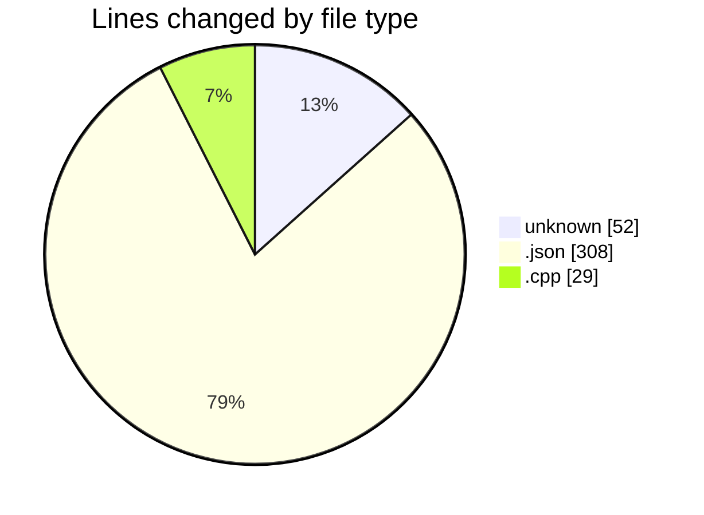

# echo - Activity Summary 

## Overall Statistics

| Stat                   | Value                                                             |
| ---------------------- | ----------------------------------------------------------------- |
| **Lines Added** (➕)   | 387                                          |
| **Lines Removed** (➖) | 2                                        |
| **Net Change** (↕)    | 385                |
| **Active Time** (⌚)   | 12 minutes |

## Modified Files
- **.gitignore** (+51, -1)
- **settings.json** (+260, -0)
- **tasks.json** (+32, -0)
- **launch.json** (+16, -0)
- **main.cpp** (+28, -1)

## Visualizations

### By File Type (Lines Changed)

### By Hour (Estimated Activity Count)

> **Last Updated:** 3/26/2025, 9:10:47 PM