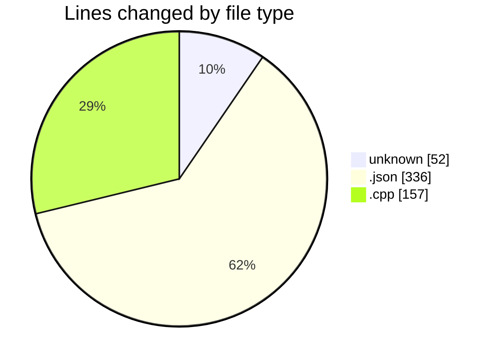
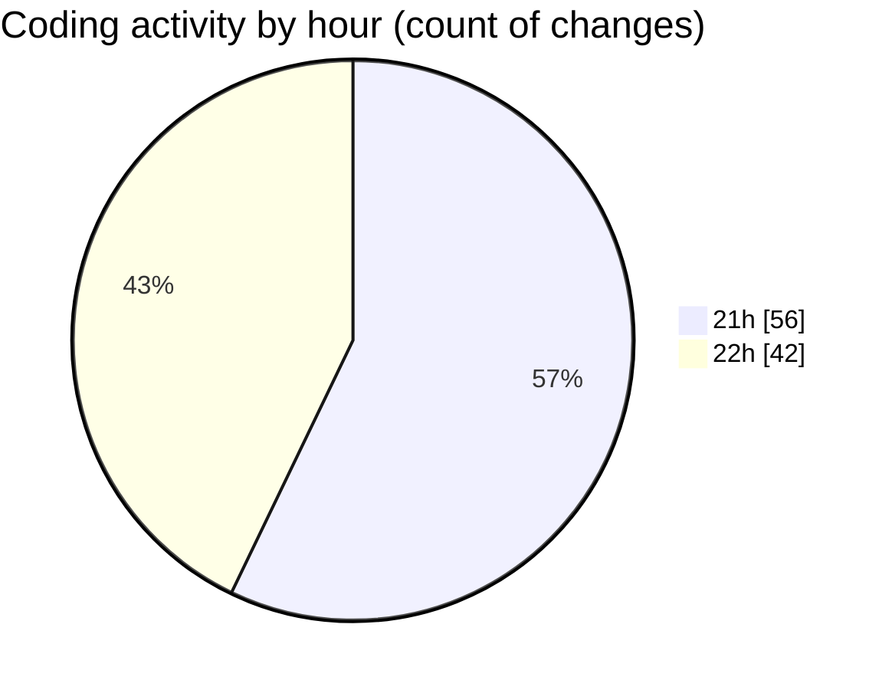

# echo - Activity Summary 

## Overall Statistics

| Stat                   | Value                                                             |
| ---------------------- | ----------------------------------------------------------------- |
| **Lines Added** (➕)   | 477                                          |
| **Lines Removed** (➖) | 68                                        |
| **Net Change** (↕)    | 409                |
| **Active Time** (⌚)   | 118 minutes |

## Modified Files
- **.gitignore** (+51, -1)
- **settings.json** (+260, -0)
- **tasks.json** (+32, -0)
- **launch.json** (+30, -14)
- **main.cpp** (+104, -53)

## Visualizations

### By File Type (Lines Changed)

### By Hour (Estimated Activity Count)

> **Last Updated:** 3/26/2025, 10:40:47 PM