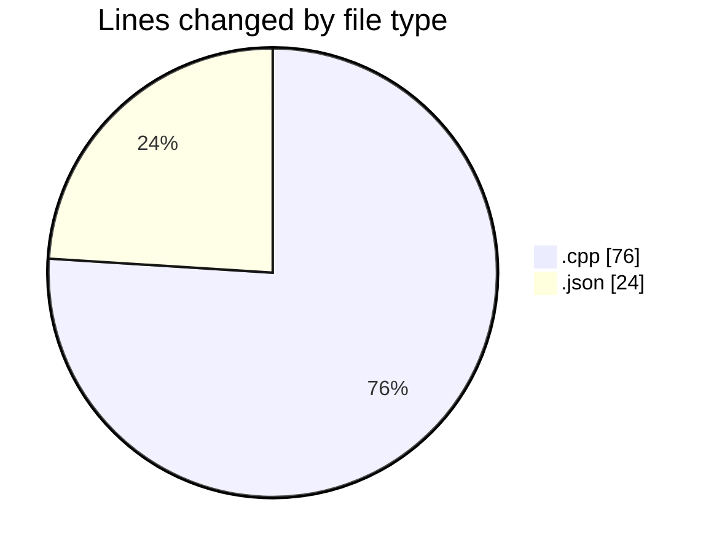
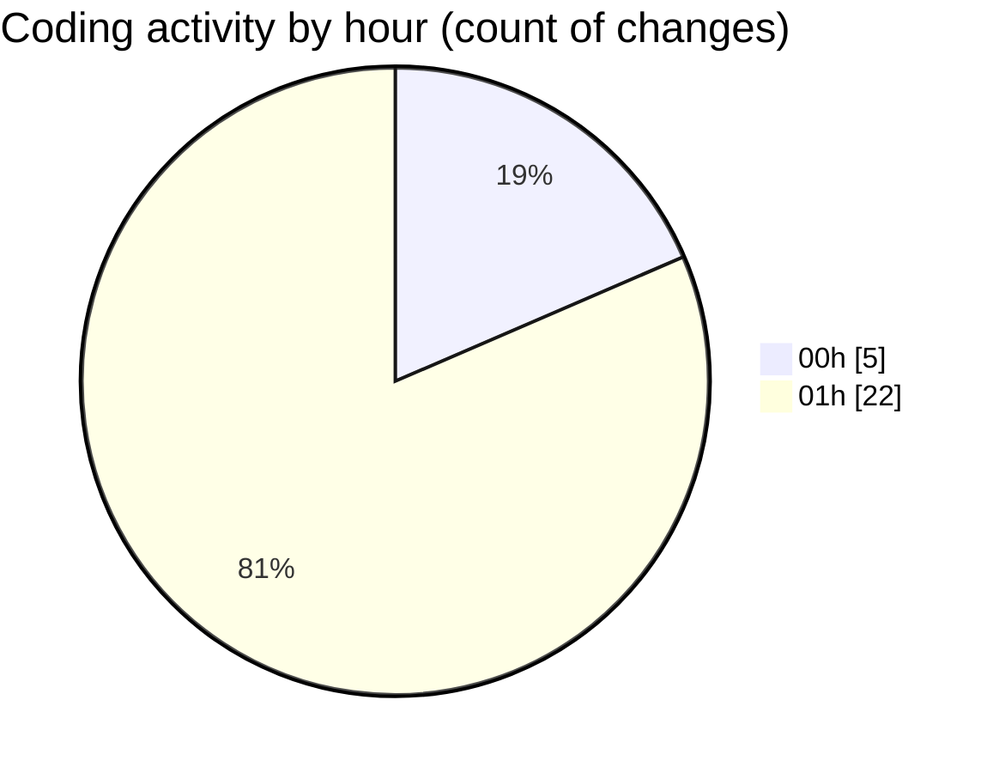

# echo - Activity Summary 

## Overall Statistics

| Stat                   | Value                                                             |
| ---------------------- | ----------------------------------------------------------------- |
| **Lines Added** (➕)   | 93                                          |
| **Lines Removed** (➖) | 7                                        |
| **Net Change** (↕)    | 86                |
| **Active Time** (⌚)   | 35 minutes |

## Modified Files
- **main.cpp** (+70, -6)
- **launch.json** (+23, -1)

## Visualizations

### By File Type (Lines Changed)

### By Hour (Estimated Activity Count)

> **Last Updated:** 3/30/2025, 1:18:25 AM