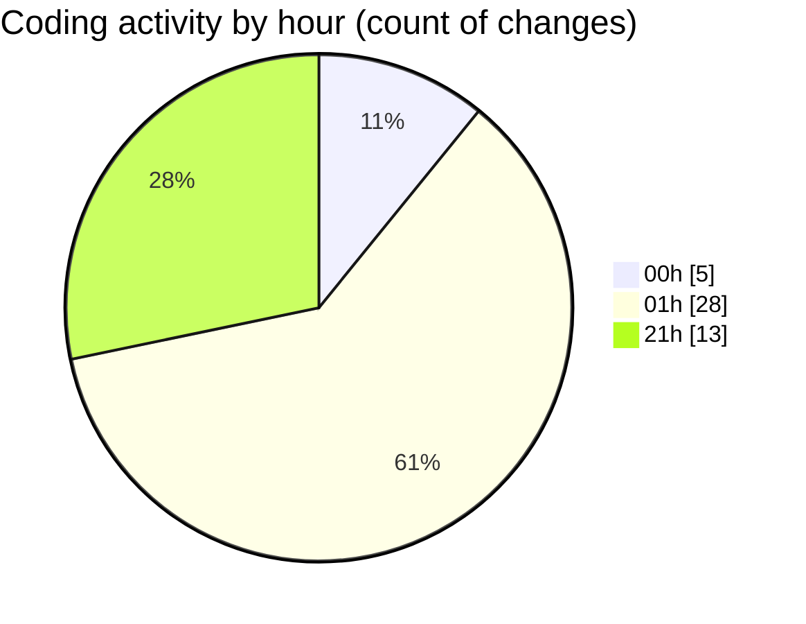

# echo - Activity Summary 

## Overall Statistics

| Stat                   | Value                                                             |
| ---------------------- | ----------------------------------------------------------------- |
| **Lines Added** (➕)   | 274                                          |
| **Lines Removed** (➖) | 56                                        |
| **Net Change** (↕)    | 218                |
| **Active Time** (⌚)   | 55 minutes |

## Modified Files
- **main.cpp** (+187, -49)
- **launch.json** (+23, -7)
- **.gitignore** (+51, -0)
- **CMakeLists.txt** (+13, -0)

## Visualizations

### By File Type (Lines Changed)

### By Hour (Estimated Activity Count)

> **Last Updated:** 3/30/2025, 9:38:34 PM