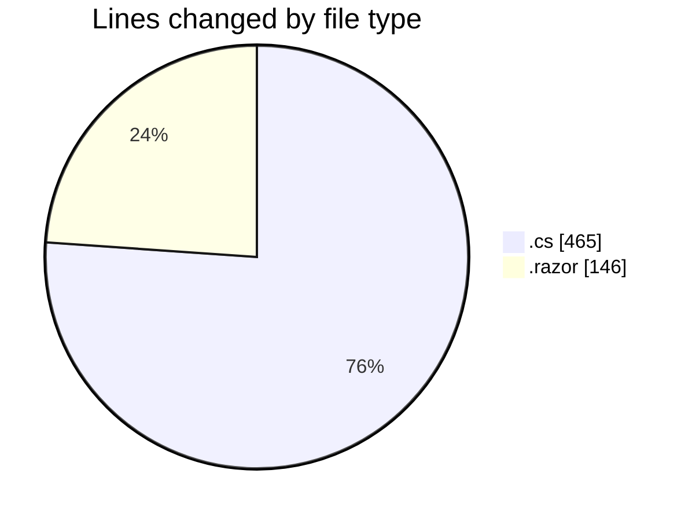
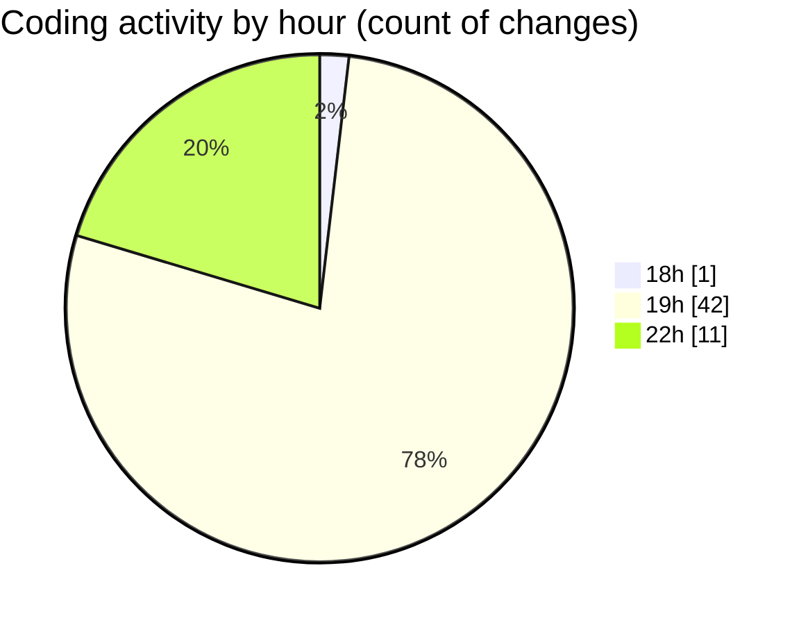

# Front-end - Activity Summary 

## Overall Statistics

| Stat                   | Value                                                             |
| ---------------------- | ----------------------------------------------------------------- |
| **Lines Added** (➕)   | 558                                          |
| **Lines Removed** (➖) | 53                                        |
| **Net Change** (↕)    | 505                |
| **Active Time** (⌚)   | 79 minutes |

## Modified Files
- **JwtAuthStateProvider.cs** (+116, -1)
- **MainLayout.razor.cs** (+125, -21)
- **MainLayout.razor** (+124, -22)
- **Program.cs** (+53, -2)
- **ProductList.razor.cs** (+53, -2)
- **CustomAuthenticationStateProvider.cs** (+87, -5)

## Visualizations

### By File Type (Lines Changed)

### By Hour (Estimated Activity Count)

> **Last Updated:** 3/30/2025, 10:15:26 PM