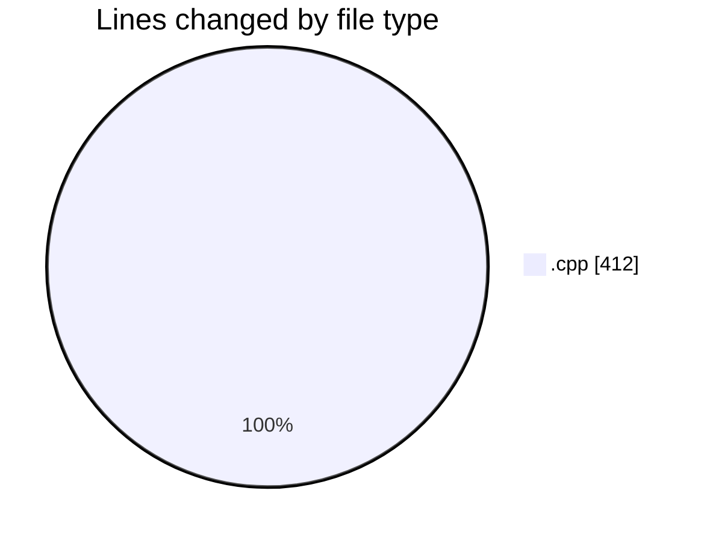

# echo - Activity Summary 

## Overall Statistics

| Stat                   | Value                                                             |
| ---------------------- | ----------------------------------------------------------------- |
| **Lines Added** (➕)   | 256                                          |
| **Lines Removed** (➖) | 156                                        |
| **Net Change** (↕)    | 100                |
| **Active Time** (⌚)   | 34 minutes |

## Modified Files
- **main.cpp** (+256, -156)

## Visualizations

### By File Type (Lines Changed)

### By Hour (Estimated Activity Count)

> **Last Updated:** 3/31/2025, 8:48:59 PM