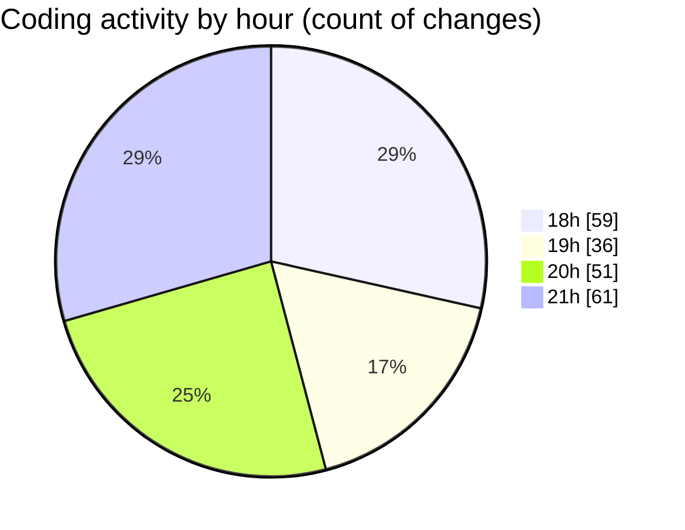

# Back-end - Activity Summary 

## Overall Statistics

| Stat                   | Value                                                             |
| ---------------------- | ----------------------------------------------------------------- |
| **Lines Added** (➕)   | 2926                                          |
| **Lines Removed** (➖) | 369                                        |
| **Net Change** (↕)    | 2557                |
| **Active Time** (⌚)   | 261 minutes |

## Modified Files
- **AuthControllerTests.cs** (+644, -338)
- **AuthController.cs** (+476, -30)
- **PayementsControllerTests.cs** (+26, -0)
- **BasketControllerTests.cs** (+295, -0)
- **OrderControllerTests.cs** (+243, -0)
- **ShopControllerTests.cs** (+205, -0)
- **PromotionControllerTests.cs** (+168, -0)
- **ProductControllerTests.cs** (+197, -0)
- **ReviewControllerTests.cs** (+275, -0)
- **PayementsController.cs** (+61, -0)
- **Backend.csproj** (+76, -0)
- **UserControllerTests.cs** (+136, -0)
- **UserService.cs** (+94, -1)
- **Tests.csproj** (+30, -0)

## Visualizations

### By File Type (Lines Changed)

### By Hour (Estimated Activity Count)

> **Last Updated:** 4/2/2025, 9:52:24 PM