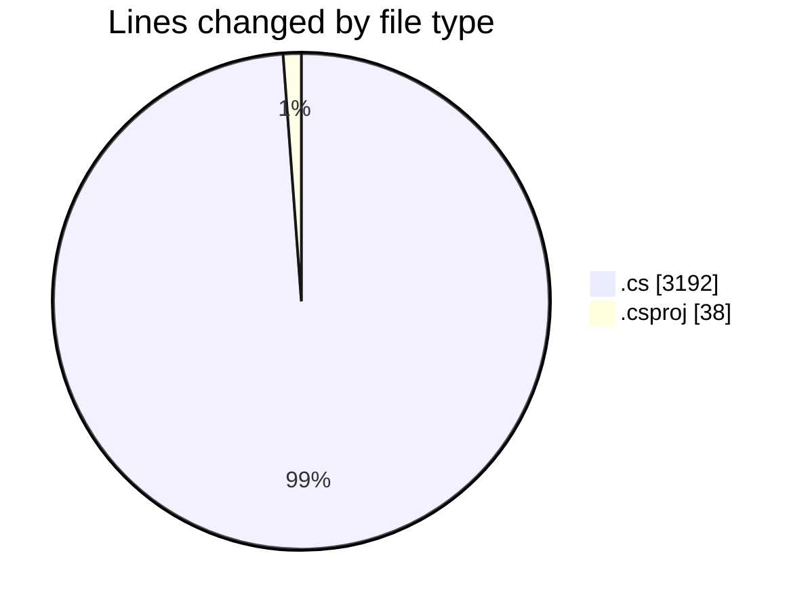
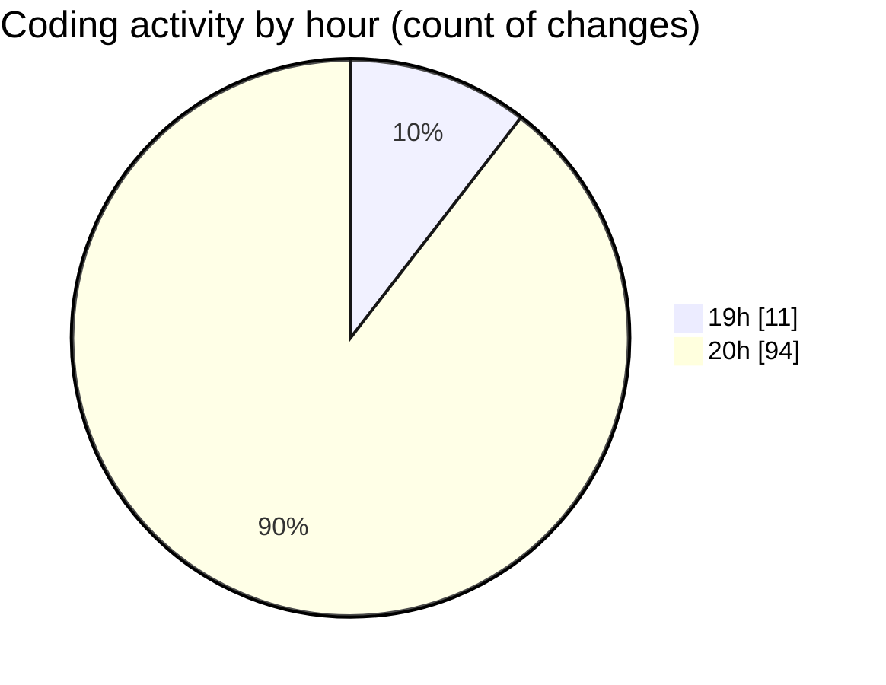

# Back-end - Activity Summary 

## Overall Statistics

| Stat                   | Value                                                             |
| ---------------------- | ----------------------------------------------------------------- |
| **Lines Added** (➕)   | 3137                                          |
| **Lines Removed** (➖) | 93                                        |
| **Net Change** (↕)    | 3044                |
| **Active Time** (⌚)   | 230 minutes |

## Modified Files
- **AuthControllerTests.cs** (+511, -74)
- **AuthController.cs** (+238, -13)
- **UserService.cs** (+98, -6)
- **PayementsController.cs** (+62, -0)
- **ReviewController.cs** (+84, -0)
- **PromotionController.cs** (+51, -0)
- **ShopController.cs** (+69, -0)
- **UserController.cs** (+52, -0)
- **InputSanitizationService.cs** (+23, -0)
- **OrderService.cs** (+83, -0)
- **ProductService.cs** (+82, -0)
- **ReviewService.cs** (+76, -0)
- **PromotionService.cs** (+95, -0)
- **ShopService.cs** (+60, -0)
- **BasketController.cs** (+50, -0)
- **AbstractController.cs** (+128, -0)
- **OrderController.cs** (+50, -0)
- **IModel.cs** (+15, -0)
- **ProductController.cs** (+50, -0)
- **UserDAO.cs** (+19, -0)
- **ApplicationRole.cs** (+41, -0)
- **Basket.cs** (+52, -0)
- **Order.cs** (+63, -0)
- **Product.cs** (+78, -0)
- **Review.cs** (+77, -0)
- **Promotion.cs** (+56, -0)
- **Shop.cs** (+65, -0)
- **User.cs** (+80, -0)
- **AbstractService.cs** (+118, -0)
- **BasketService.cs** (+86, -0)
- **ProductDAO.cs** (+19, -0)
- **ReviewDAO.cs** (+50, -0)
- **PromotionDAO.cs** (+19, -0)
- **ShopDAO.cs** (+19, -0)
- **OrderStatus.cs** (+34, -0)
- **ShopConnectDbContext.cs** (+114, -0)
- **Roles.cs** (+28, -0)
- **BasketDAO.cs** (+49, -0)
- **AbstractDAO.cs** (+106, -0)
- **OrderDAO.cs** (+49, -0)
- **Backend.csproj** (+38, -0)

## Visualizations

### By File Type (Lines Changed)

### By Hour (Estimated Activity Count)

> **Last Updated:** 4/3/2025, 8:48:11 PM