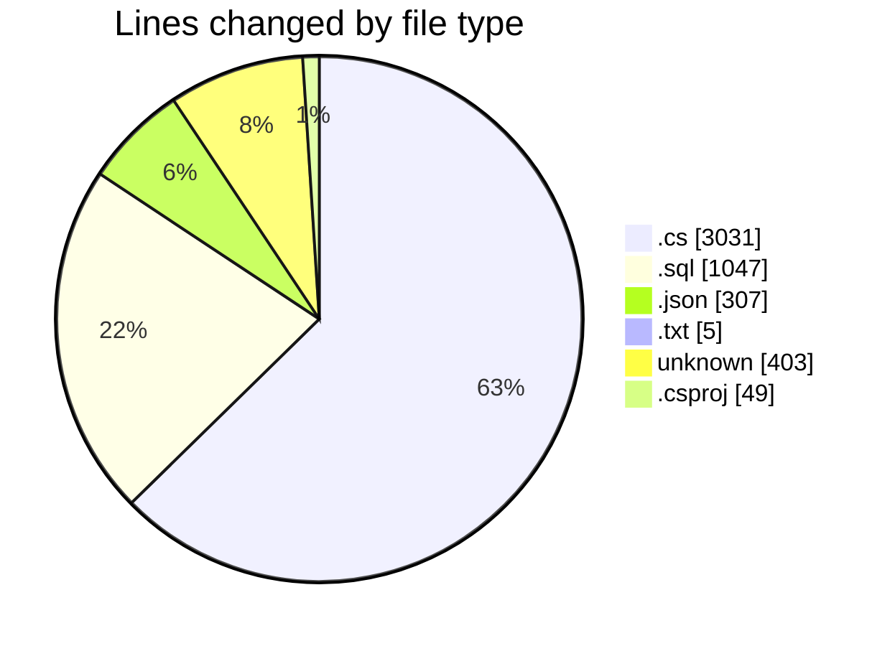
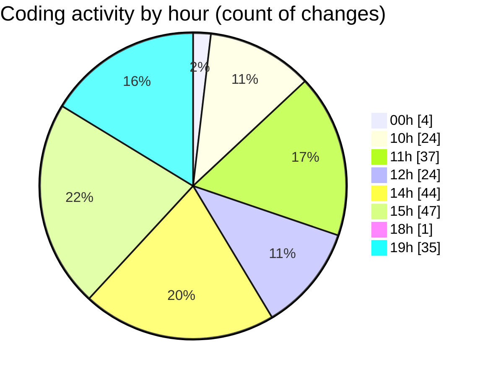

# Back-end - Activity Summary 

## Overall Statistics

| Stat                   | Value                                                             |
| ---------------------- | ----------------------------------------------------------------- |
| **Lines Added** (➕)   | 4219                                          |
| **Lines Removed** (➖) | 623                                        |
| **Net Change** (↕)    | 3596                |
| **Active Time** (⌚)   | 278 minutes |

## Modified Files
- **Program.cs** (+818, -31)
- **insert.sql** (+513, -400)
- **settings.json** (+11, -0)
- **TestUsers.txt** (+3, -2)
- **TestUsers.json** (+25, -1)
- **commands.sql** (+72, -62)
- **ShopDAO.cs** (+104, -6)
- **ShopConnectDbContext.cs** (+439, -55)
- **ProductDAO.cs** (+106, -12)
- **.gitignore** (+403, -0)
- **Backend.csproj** (+49, -0)
- **Promotion.cs** (+119, -35)
- **settings.json** (+270, -0)
- **PromotionDAO.cs** (+56, -9)
- **User.cs** (+80, -0)
- **Product.cs** (+78, -0)
- **ShopConnectDbContextModelSnapshot.cs** (+588, -0)
- **PromotionControllerTests.cs** (+199, -1)
- **PayementsControllerTests.cs** (+26, -0)
- **AuthController.cs** (+229, -4)
- **BasketProduct.cs** (+31, -5)

## Visualizations

### By File Type (Lines Changed)

### By Hour (Estimated Activity Count)

> **Last Updated:** 4/4/2025, 7:40:27 PM