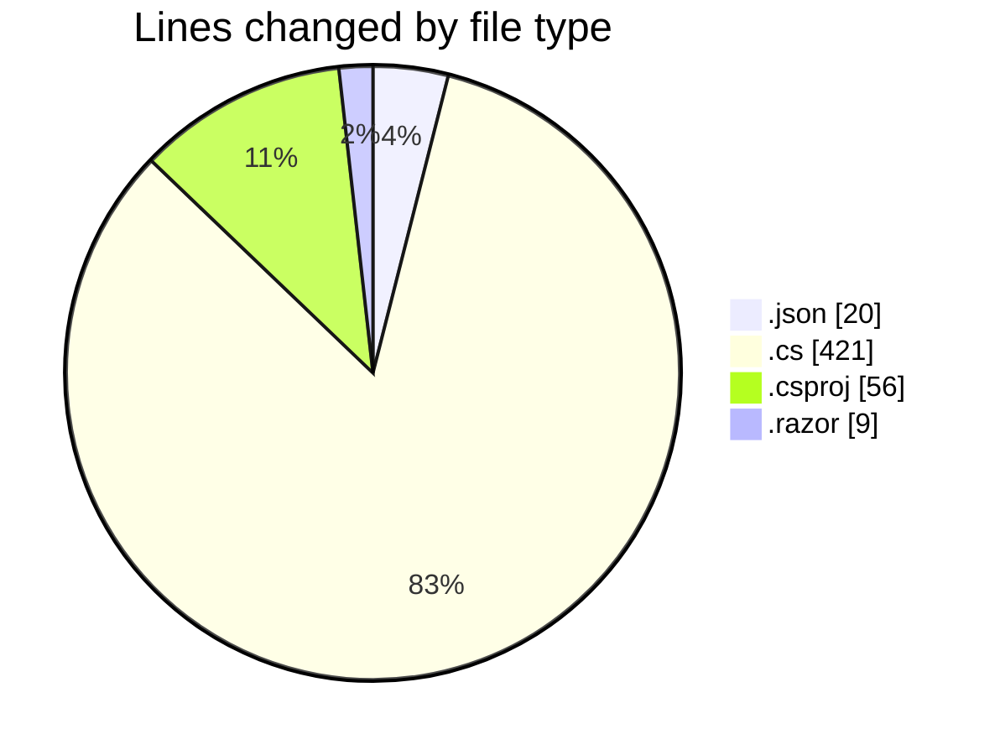
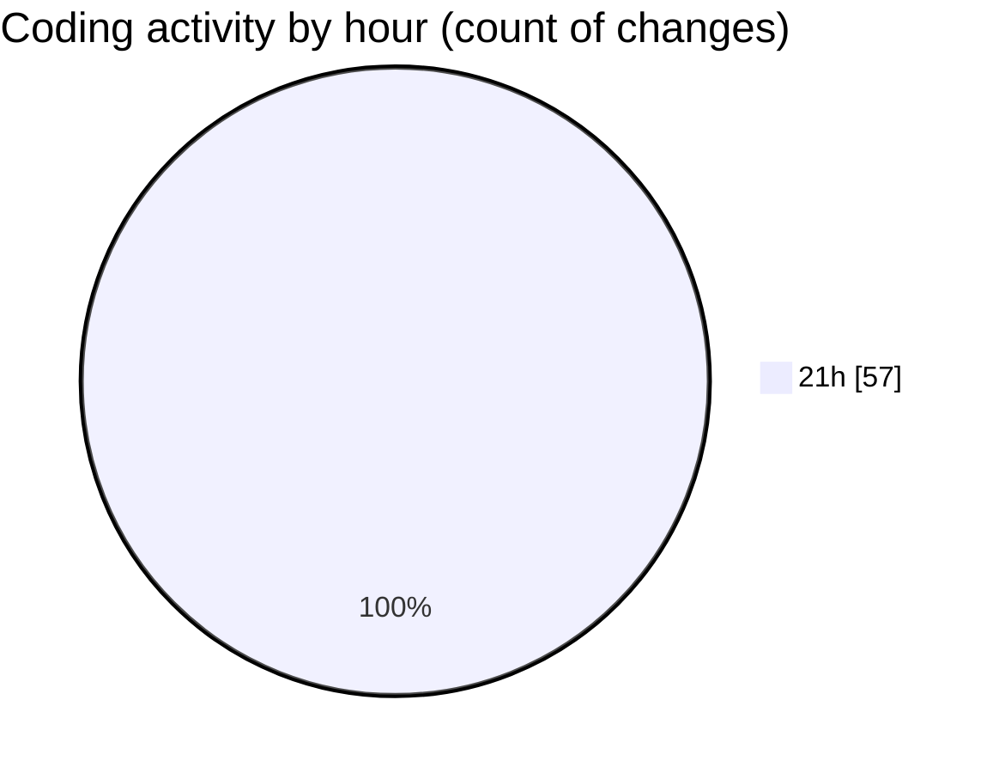

# SchoolManagement - Activity Summary 

## Overall Statistics

| Stat                   | Value                                                             |
| ---------------------- | ----------------------------------------------------------------- |
| **Lines Added** (➕)   | 486                                          |
| **Lines Removed** (➖) | 20                                        |
| **Net Change** (↕)    | 466                |
| **Active Time** (⌚)   | 63 minutes |

## Modified Files
- **settings.json** (+20, -0)
- **SchoolManagementDbContext.cs** (+34, -2)
- **Course.cs** (+54, -2)
- **Enrollment.cs** (+82, -4)
- **ErrorViewModel.cs** (+18, -2)
- **Student.cs** (+82, -2)
- **Teacher.cs** (+47, -3)
- **Backend.csproj** (+23, -4)
- **Program.cs** (+34, -0)
- **SchoolManagement.Core.csproj** (+16, -0)
- **Frontend.csproj** (+12, -1)
- **Program.cs** (+36, -0)
- **Routes.razor** (+9, -0)
- **User.cs** (+9, -0)
- **IUser.cs** (+10, -0)

## Visualizations

### By File Type (Lines Changed)

### By Hour (Estimated Activity Count)

> **Last Updated:** 4/5/2025, 9:48:44 PM