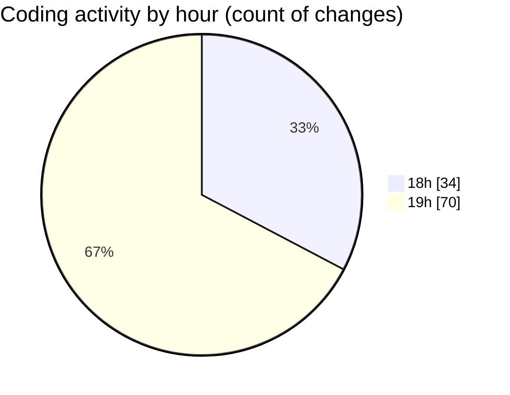

# Back-end - Activity Summary 

## Overall Statistics

| Stat                   | Value                                                             |
| ---------------------- | ----------------------------------------------------------------- |
| **Lines Added** (➕)   | 3840                                          |
| **Lines Removed** (➖) | 69                                        |
| **Net Change** (↕)    | 3771                |
| **Active Time** (⌚)   | 120 minutes |

## Modified Files
- **ProductController.cs** (+164, -35)
- **SecurityHeadersMiddleware.cs** (+64, -0)
- **ApiResponse.cs** (+5, -0)
- **ApiResponse.cs** (+34, -1)
- **ProductControllerTests.cs** (+199, -0)
- **AuthControllerTests.cs** (+446, -5)
- **ShopConnectDbContextModelSnapshot.cs** (+610, -20)
- **20250404084352_ShopConnectMigration.cs** (+495, -1)
- **20250404123734_AddPromotionProductRelationship.cs** (+85, -0)
- **20250404130458_CreateBasketProductJoinTable.cs** (+84, -0)
- **20250404132716_AddReviewUserRelation.cs** (+25, -0)
- **20250404134438_InitializeReviewsList.cs** (+25, -0)
- **BasketControllerTests.cs** (+297, -0)
- **OrderControllerTests.cs** (+245, -0)
- **PayementsControllerTests.cs** (+28, -0)
- **PromotionControllerTests.cs** (+200, -0)
- **ReviewControllerTests.cs** (+277, -0)
- **ShopControllerTests.cs** (+207, -0)
- **UserControllerTests.cs** (+138, -0)
- **Program.cs** (+212, -7)

## Visualizations

### By File Type (Lines Changed)

### By Hour (Estimated Activity Count)

> **Last Updated:** 4/6/2025, 7:31:32 PM