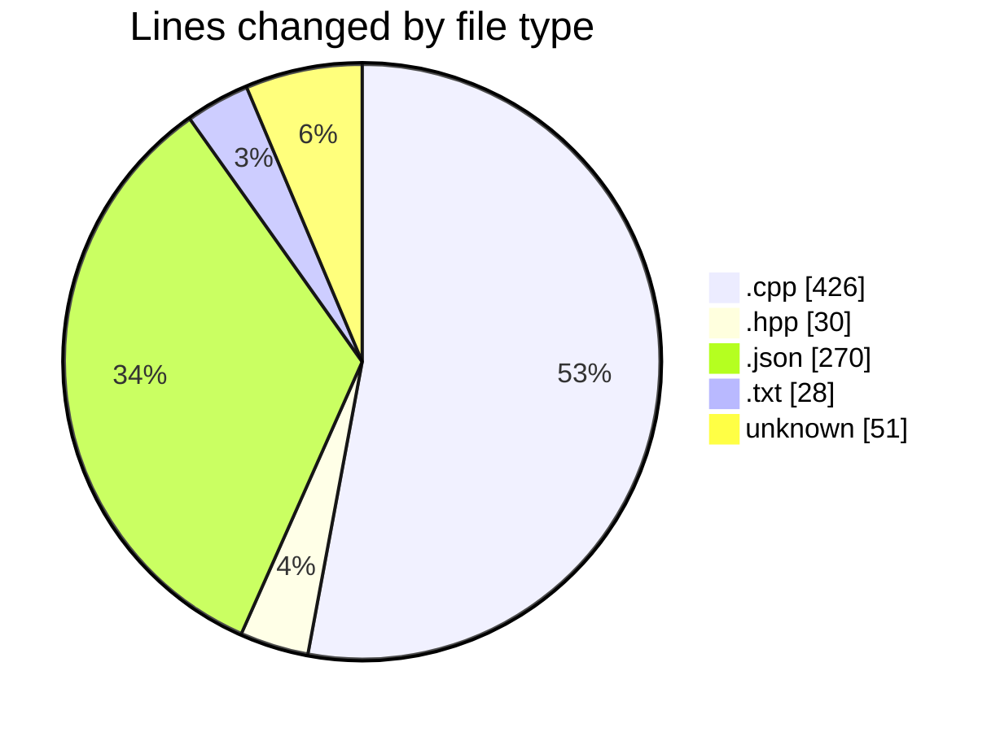
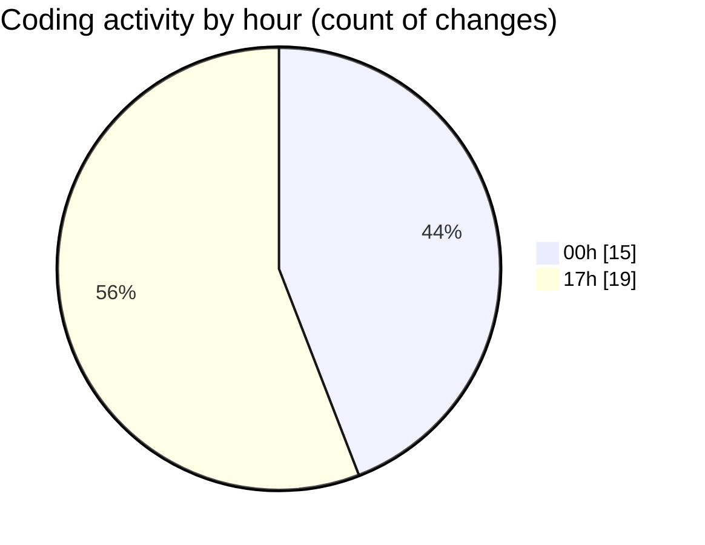

# echo - Activity Summary 

## Overall Statistics

| Stat                   | Value                                                             |
| ---------------------- | ----------------------------------------------------------------- |
| **Lines Added** (➕)   | 738                                          |
| **Lines Removed** (➖) | 67                                        |
| **Net Change** (↕)    | 671                |
| **Active Time** (⌚)   | 39 minutes |

## Modified Files
- **main.cpp** (+264, -44)
- **Parser.hpp** (+22, -8)
- **Parser.cpp** (+104, -14)
- **settings.json** (+270, -0)
- **CMakeLists.txt** (+27, -1)
- **.gitignore** (+51, -0)

## Visualizations

### By File Type (Lines Changed)

### By Hour (Estimated Activity Count)

> **Last Updated:** 4/6/2025, 5:21:47 PM