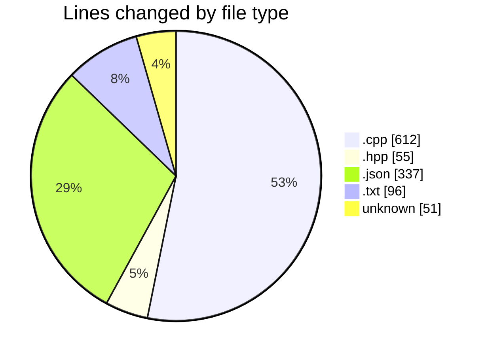
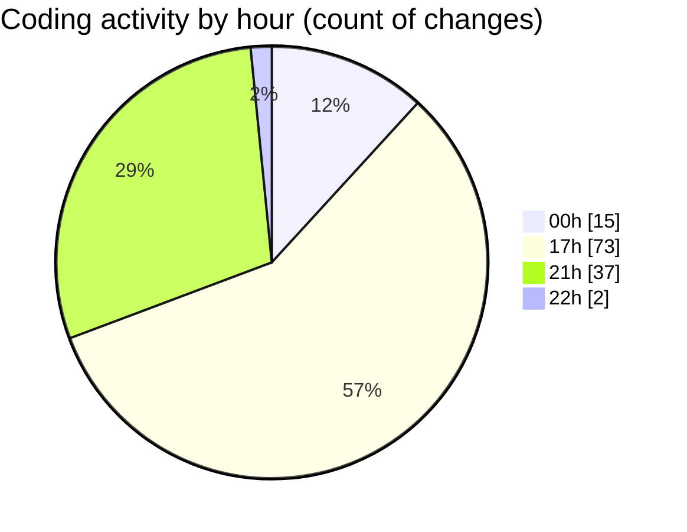

# echo - Activity Summary 

## Overall Statistics

| Stat                   | Value                                                             |
| ---------------------- | ----------------------------------------------------------------- |
| **Lines Added** (➕)   | 999                                          |
| **Lines Removed** (➖) | 152                                        |
| **Net Change** (↕)    | 847                |
| **Active Time** (⌚)   | 155 minutes |

## Modified Files
- **main.cpp** (+267, -88)
- **Parser.hpp** (+41, -14)
- **Parser.cpp** (+235, -22)
- **settings.json** (+270, -0)
- **CMakeLists.txt** (+72, -24)
- **.gitignore** (+51, -0)
- **tasks.json** (+45, -2)
- **launch.json** (+18, -2)

## Visualizations

### By File Type (Lines Changed)

### By Hour (Estimated Activity Count)

> **Last Updated:** 4/6/2025, 10:02:59 PM