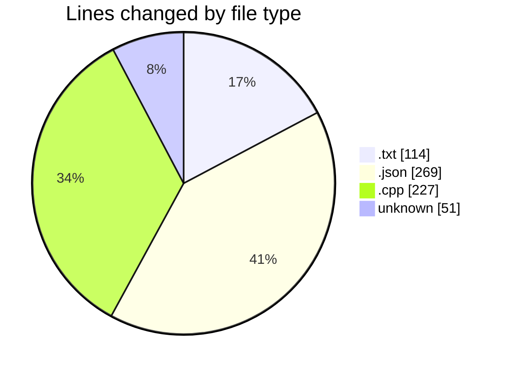
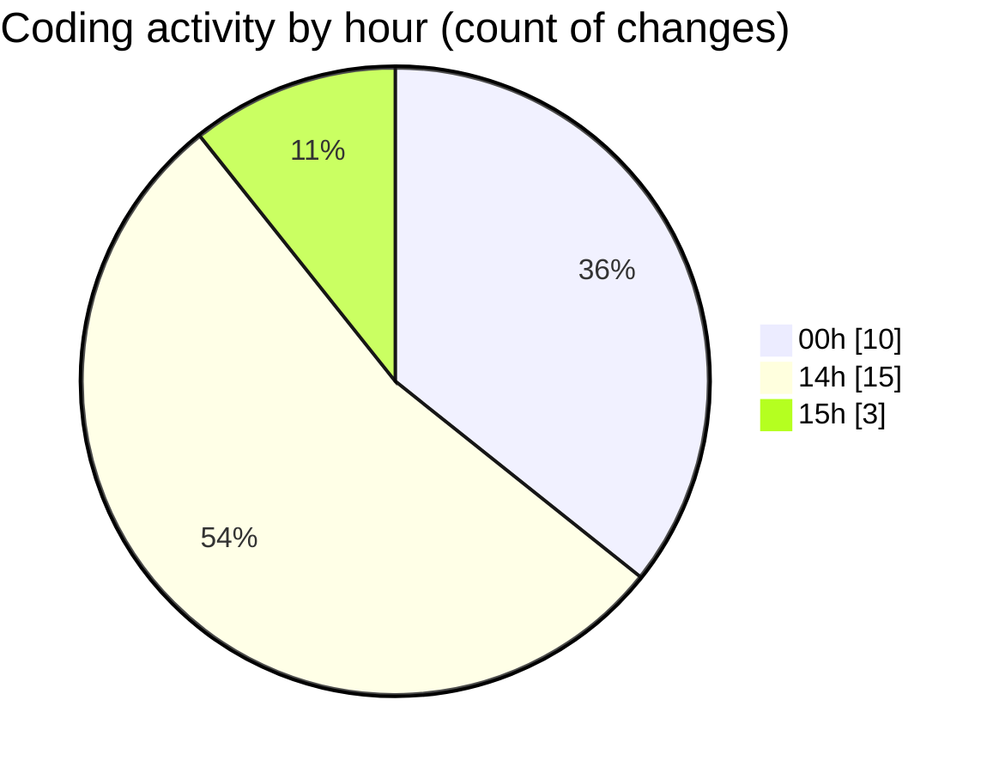

# echo - Activity Summary 

## Overall Statistics

| Stat                   | Value                                                             |
| ---------------------- | ----------------------------------------------------------------- |
| **Lines Added** (➕)   | 639                                          |
| **Lines Removed** (➖) | 22                                        |
| **Net Change** (↕)    | 617                |
| **Active Time** (⌚)   | 36 minutes |

## Modified Files
- **CMakeLists.txt** (+92, -22)
- **settings.json** (+269, -0)
- **main.cpp** (+140, -0)
- **Parser.cpp** (+87, -0)
- **.gitignore** (+51, -0)

## Visualizations

### By File Type (Lines Changed)

### By Hour (Estimated Activity Count)

> **Last Updated:** 4/7/2025, 3:13:58 PM