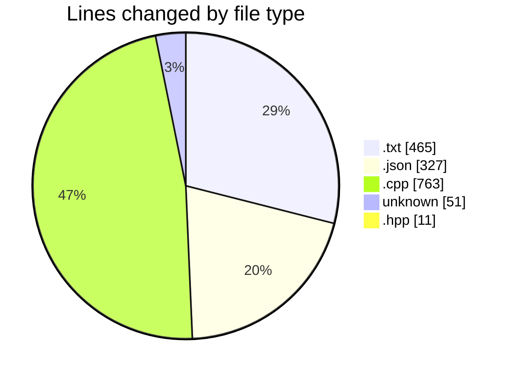
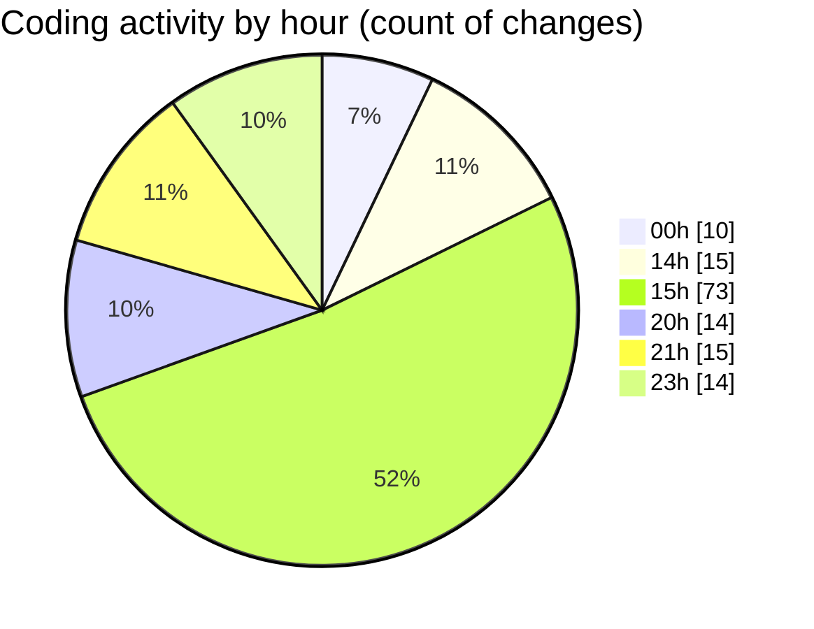

# echo - Activity Summary 

## Overall Statistics

| Stat                   | Value                                                             |
| ---------------------- | ----------------------------------------------------------------- |
| **Lines Added** (➕)   | 1442                                          |
| **Lines Removed** (➖) | 175                                        |
| **Net Change** (↕)    | 1267                |
| **Active Time** (⌚)   | 181 minutes |

## Modified Files
- **CMakeLists.txt** (+382, -83)
- **settings.json** (+269, -0)
- **main.cpp** (+141, -4)
- **Parser.cpp** (+394, -72)
- **.gitignore** (+51, -0)
- **Parser.hpp** (+11, -0)
- **launch.json** (+20, -0)
- **test_parser.cpp** (+39, -9)
- **tasks.json** (+38, -0)
- **testParser.cpp** (+97, -7)

## Visualizations

### By File Type (Lines Changed)

### By Hour (Estimated Activity Count)

> **Last Updated:** 4/7/2025, 11:21:53 PM