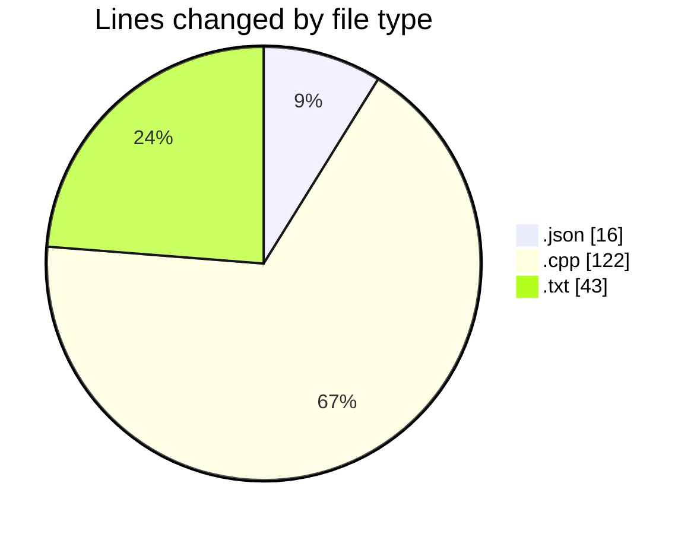
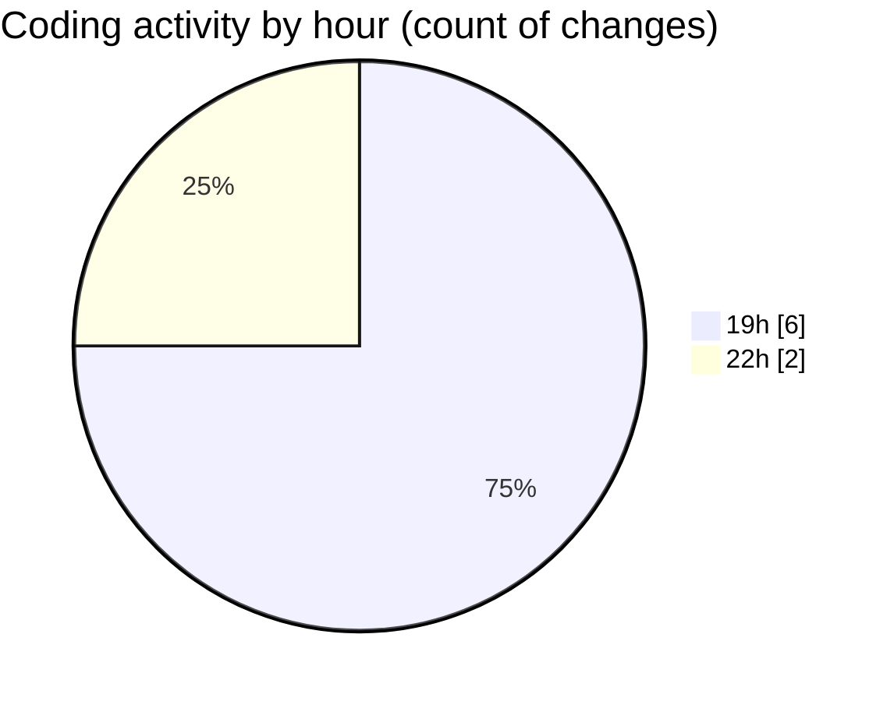

# echo - Activity Summary 

## Overall Statistics

| Stat                   | Value                                                             |
| ---------------------- | ----------------------------------------------------------------- |
| **Lines Added** (➕)   | 179                                          |
| **Lines Removed** (➖) | 2                                        |
| **Net Change** (↕)    | 177                |
| **Active Time** (⌚)   | 9 minutes |

## Modified Files
- **launch.json** (+16, -0)
- **Parser.cpp** (+120, -2)
- **CMakeLists.txt** (+43, -0)

## Visualizations

### By File Type (Lines Changed)

### By Hour (Estimated Activity Count)

> **Last Updated:** 4/18/2025, 10:29:59 PM