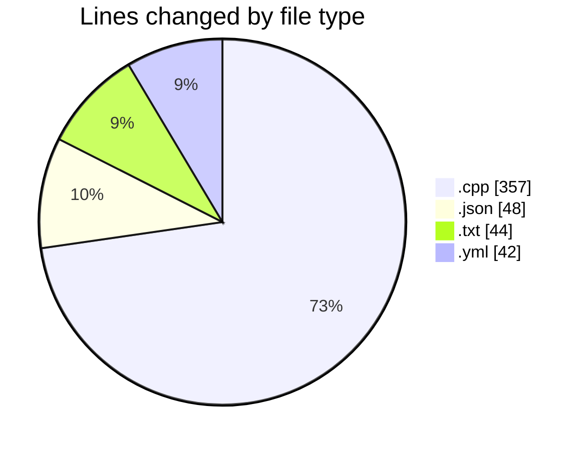
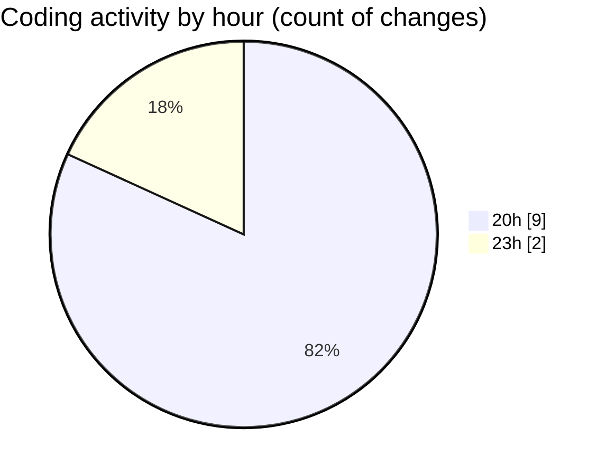

# echo - Activity Summary 

## Overall Statistics

| Stat                   | Value                                                             |
| ---------------------- | ----------------------------------------------------------------- |
| **Lines Added** (➕)   | 490                                          |
| **Lines Removed** (➖) | 1                                        |
| **Net Change** (↕)    | 489                |
| **Active Time** (⌚)   | 14 minutes |

## Modified Files
- **Parser.cpp** (+356, -1)
- **launch.json** (+48, -0)
- **CMakeLists.txt** (+44, -0)
- **update_submodules.yml** (+42, -0)

## Visualizations

### By File Type (Lines Changed)

### By Hour (Estimated Activity Count)

> **Last Updated:** 4/19/2025, 11:59:01 PM