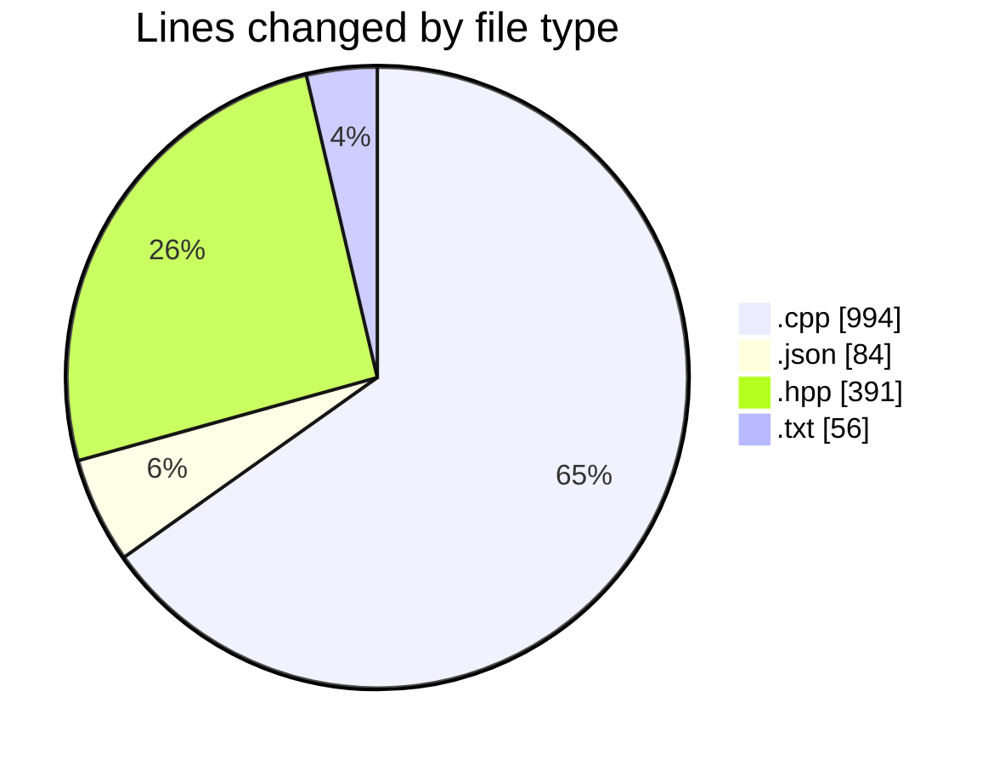
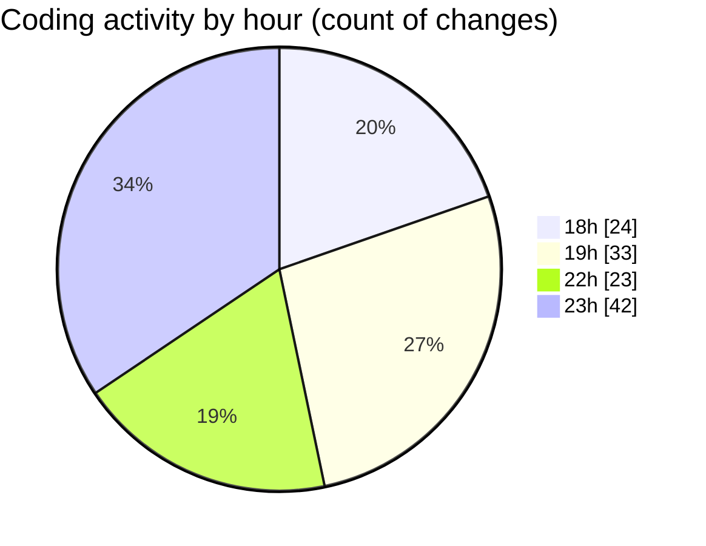

# echo - Activity Summary 

## Overall Statistics

| Stat                   | Value                                                             |
| ---------------------- | ----------------------------------------------------------------- |
| **Lines Added** (➕)   | 1398                                          |
| **Lines Removed** (➖) | 127                                        |
| **Net Change** (↕)    | 1271                |
| **Active Time** (⌚)   | 153 minutes |

## Modified Files
- **Parser.cpp** (+589, -107)
- **launch.json** (+82, -2)
- **Parser.hpp** (+380, -11)
- **main.cpp** (+207, -1)
- **testParser.cpp** (+90, -0)
- **CMakeLists.txt** (+50, -6)

## Visualizations

### By File Type (Lines Changed)

### By Hour (Estimated Activity Count)

> **Last Updated:** 4/21/2025, 11:58:24 PM