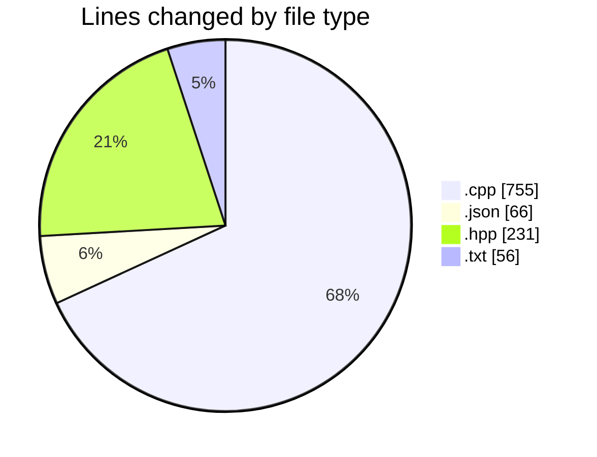
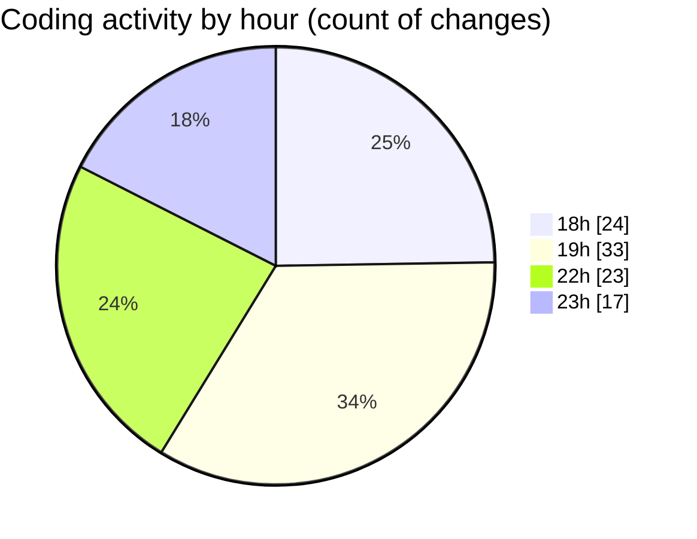

# echo - Activity Summary 

## Overall Statistics

| Stat                   | Value                                                             |
| ---------------------- | ----------------------------------------------------------------- |
| **Lines Added** (➕)   | 989                                          |
| **Lines Removed** (➖) | 119                                        |
| **Net Change** (↕)    | 870                |
| **Active Time** (⌚)   | 120 minutes |

## Modified Files
- **Parser.cpp** (+421, -105)
- **launch.json** (+65, -1)
- **Parser.hpp** (+225, -6)
- **main.cpp** (+138, -1)
- **testParser.cpp** (+90, -0)
- **CMakeLists.txt** (+50, -6)

## Visualizations

### By File Type (Lines Changed)

### By Hour (Estimated Activity Count)

> **Last Updated:** 4/21/2025, 11:23:06 PM