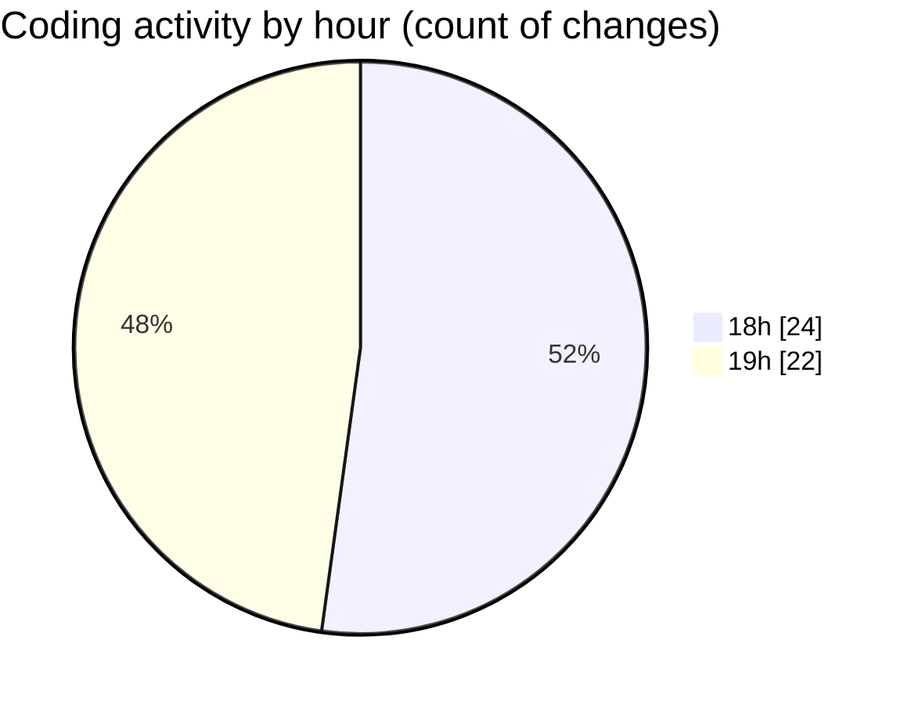

# echo - Activity Summary 

## Overall Statistics

| Stat                   | Value                                                             |
| ---------------------- | ----------------------------------------------------------------- |
| **Lines Added** (➕)   | 520                                          |
| **Lines Removed** (➖) | 103                                        |
| **Net Change** (↕)    | 417                |
| **Active Time** (⌚)   | 52 minutes |

## Modified Files
- **Parser.cpp** (+232, -96)
- **launch.json** (+32, -0)
- **Parser.hpp** (+47, -0)
- **main.cpp** (+69, -1)
- **testParser.cpp** (+90, -0)
- **CMakeLists.txt** (+50, -6)

## Visualizations

### By File Type (Lines Changed)

### By Hour (Estimated Activity Count)

> **Last Updated:** 4/21/2025, 7:34:23 PM