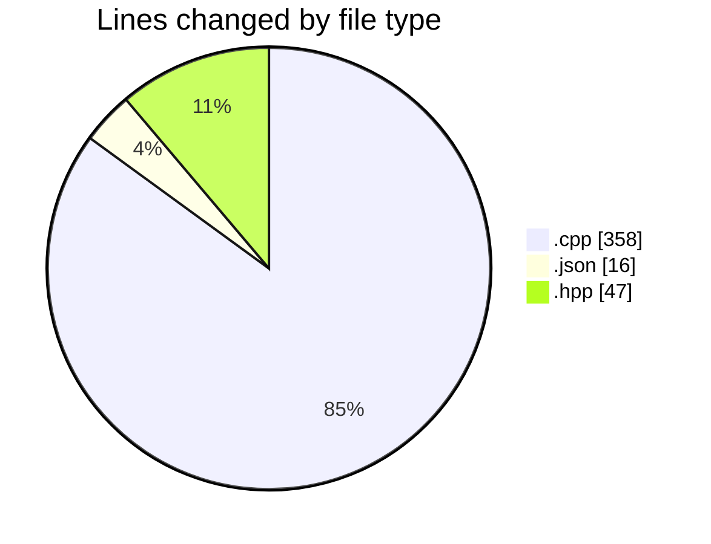
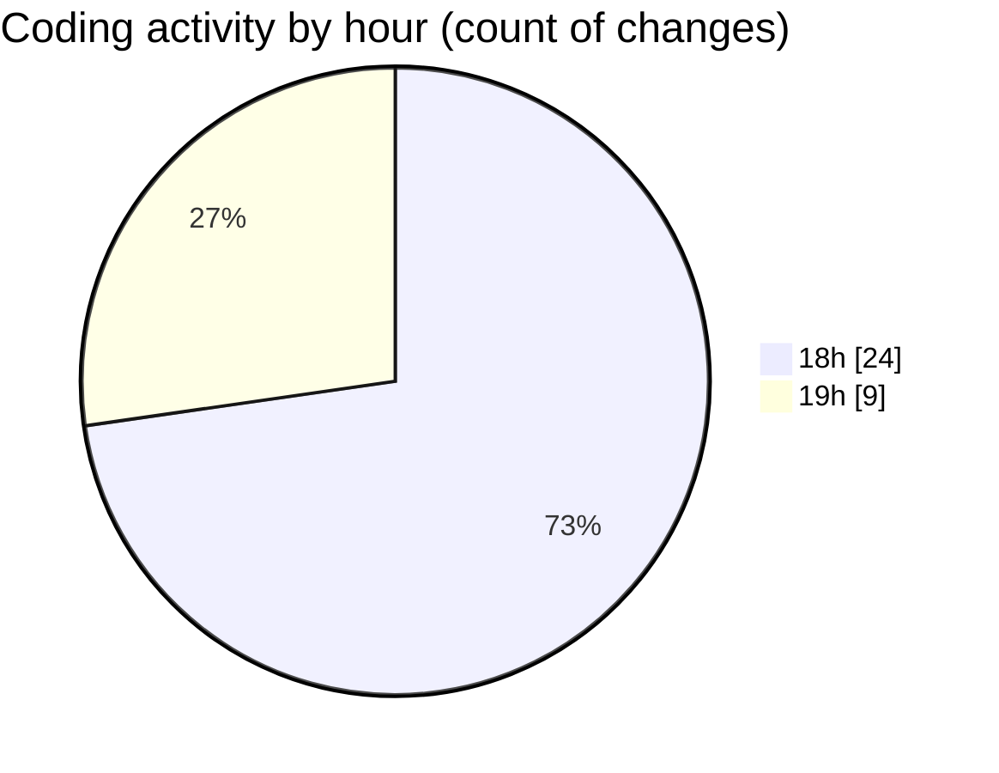

# echo - Activity Summary 

## Overall Statistics

| Stat                   | Value                                                             |
| ---------------------- | ----------------------------------------------------------------- |
| **Lines Added** (➕)   | 335                                          |
| **Lines Removed** (➖) | 86                                        |
| **Net Change** (↕)    | 249                |
| **Active Time** (⌚)   | 37 minutes |

## Modified Files
- **Parser.cpp** (+158, -85)
- **launch.json** (+16, -0)
- **Parser.hpp** (+47, -0)
- **main.cpp** (+69, -1)
- **testParser.cpp** (+45, -0)

## Visualizations

### By File Type (Lines Changed)

### By Hour (Estimated Activity Count)

> **Last Updated:** 4/21/2025, 7:03:22 PM