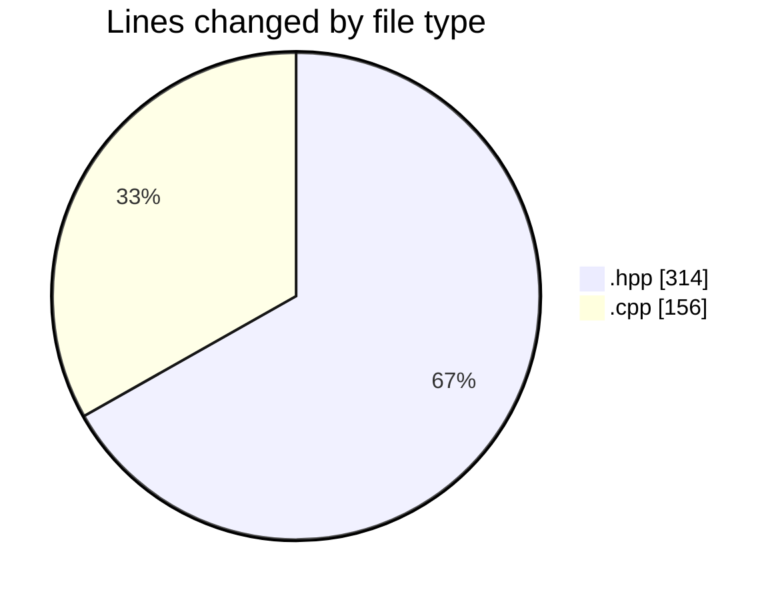
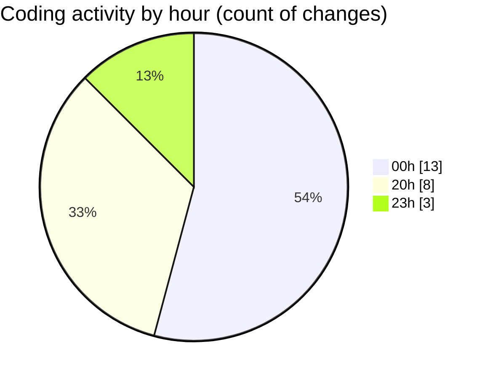

# echo - Activity Summary 

## Overall Statistics

| Stat                   | Value                                                             |
| ---------------------- | ----------------------------------------------------------------- |
| **Lines Added** (➕)   | 386                                          |
| **Lines Removed** (➖) | 84                                        |
| **Net Change** (↕)    | 302                |
| **Active Time** (⌚)   | 32 minutes |

## Modified Files
- **Parser.hpp** (+230, -84)
- **Parser.cpp** (+87, -0)
- **main.cpp** (+69, -0)

## Visualizations

### By File Type (Lines Changed)

### By Hour (Estimated Activity Count)

> **Last Updated:** 4/22/2025, 8:22:24 PM