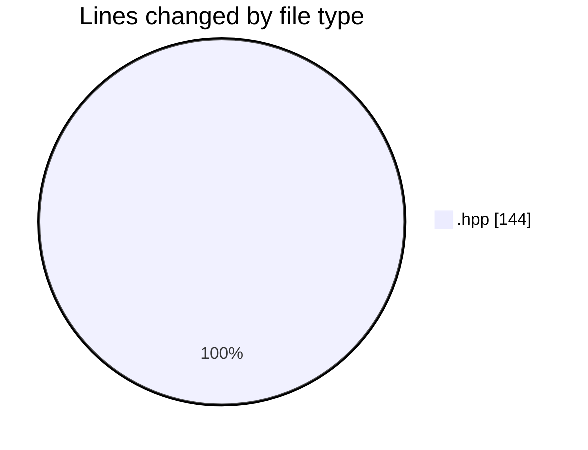
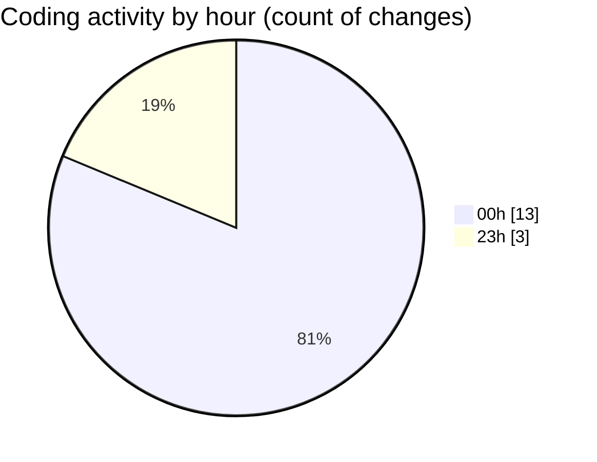

# echo - Activity Summary 

## Overall Statistics

| Stat                   | Value                                                             |
| ---------------------- | ----------------------------------------------------------------- |
| **Lines Added** (➕)   | 62                                          |
| **Lines Removed** (➖) | 82                                        |
| **Net Change** (↕)    | -20                |
| **Active Time** (⌚)   | 21 minutes |

## Modified Files
- **Parser.hpp** (+62, -82)

## Visualizations

### By File Type (Lines Changed)

### By Hour (Estimated Activity Count)

> **Last Updated:** 4/22/2025, 12:08:24 AM