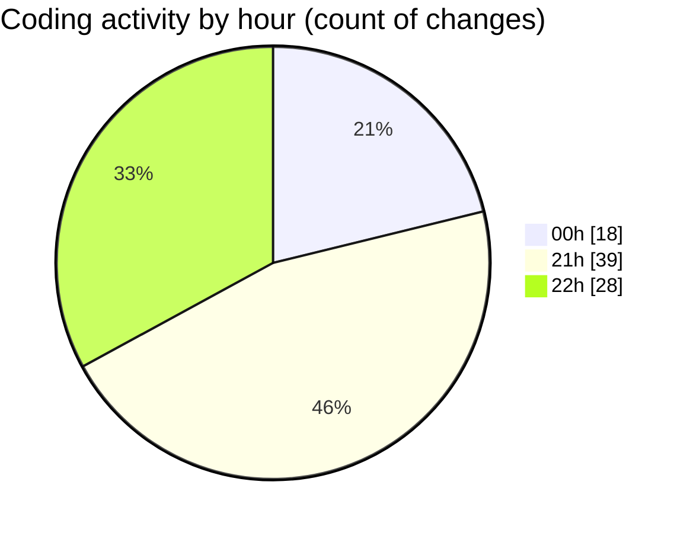

# echo - Activity Summary 

## Overall Statistics

| Stat                   | Value                                                             |
| ---------------------- | ----------------------------------------------------------------- |
| **Lines Added** (➕)   | 428                                          |
| **Lines Removed** (➖) | 69                                        |
| **Net Change** (↕)    | 359                |
| **Active Time** (⌚)   | 111 minutes |

## Modified Files
- **Parser.cpp** (+299, -68)
- **launch.json** (+32, -0)
- **Parser.hpp** (+97, -1)

## Visualizations

### By File Type (Lines Changed)

### By Hour (Estimated Activity Count)

> **Last Updated:** 4/23/2025, 10:35:19 PM