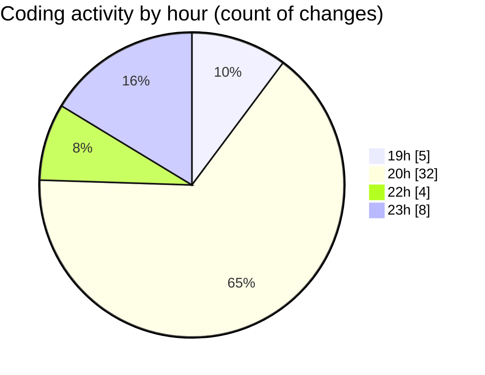

# echo - Activity Summary 

## Overall Statistics

| Stat                   | Value                                                             |
| ---------------------- | ----------------------------------------------------------------- |
| **Lines Added** (➕)   | 590                                          |
| **Lines Removed** (➖) | 73                                        |
| **Net Change** (↕)    | 517                |
| **Active Time** (⌚)   | 60 minutes |

## Modified Files
- **Parser.cpp** (+323, -69)
- **Parser.hpp** (+198, -3)
- **main.cpp** (+69, -1)

## Visualizations

### By File Type (Lines Changed)

### By Hour (Estimated Activity Count)

> **Last Updated:** 4/25/2025, 11:26:22 PM