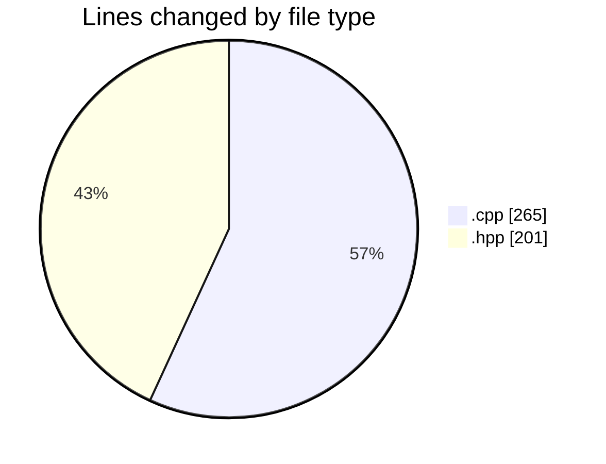
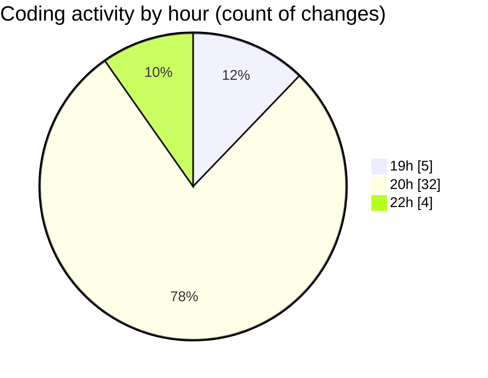

# echo - Activity Summary 

## Overall Statistics

| Stat                   | Value                                                             |
| ---------------------- | ----------------------------------------------------------------- |
| **Lines Added** (➕)   | 395                                          |
| **Lines Removed** (➖) | 71                                        |
| **Net Change** (↕)    | 324                |
| **Active Time** (⌚)   | 52 minutes |

## Modified Files
- **Parser.cpp** (+197, -68)
- **Parser.hpp** (+198, -3)

## Visualizations

### By File Type (Lines Changed)

### By Hour (Estimated Activity Count)

> **Last Updated:** 4/25/2025, 10:36:33 PM