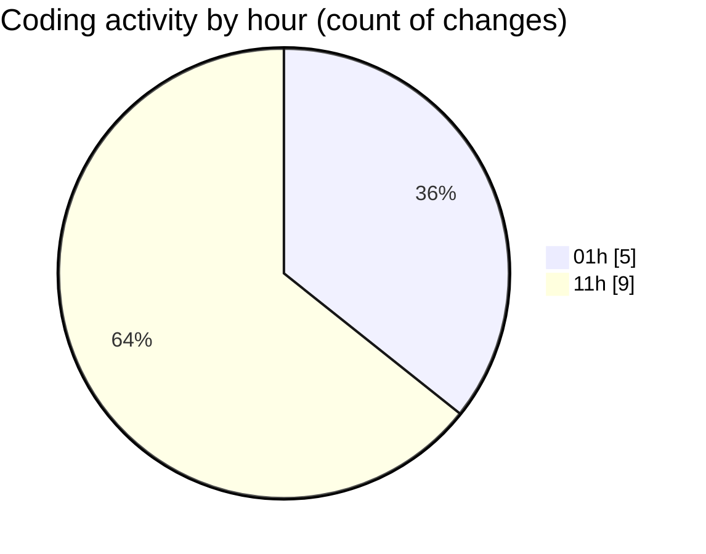

# echo - Activity Summary 

## Overall Statistics

| Stat                   | Value                                                             |
| ---------------------- | ----------------------------------------------------------------- |
| **Lines Added** (➕)   | 270                                          |
| **Lines Removed** (➖) | 8                                        |
| **Net Change** (↕)    | 262                |
| **Active Time** (⌚)   | 15 minutes |

## Modified Files
- **Parser.cpp** (+270, -8)

## Visualizations

### By File Type (Lines Changed)

### By Hour (Estimated Activity Count)

> **Last Updated:** 4/26/2025, 11:52:28 AM