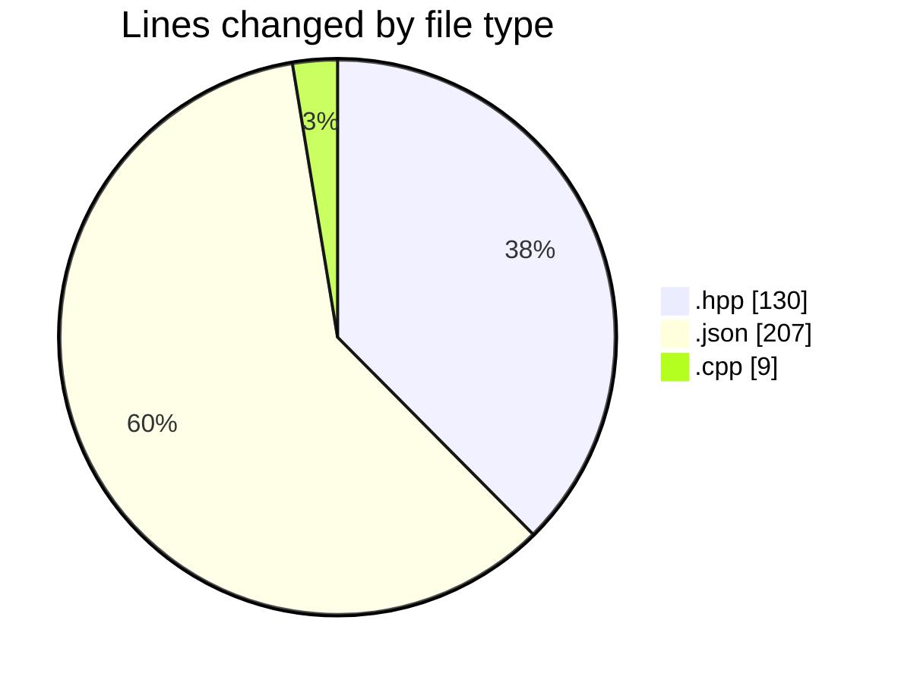
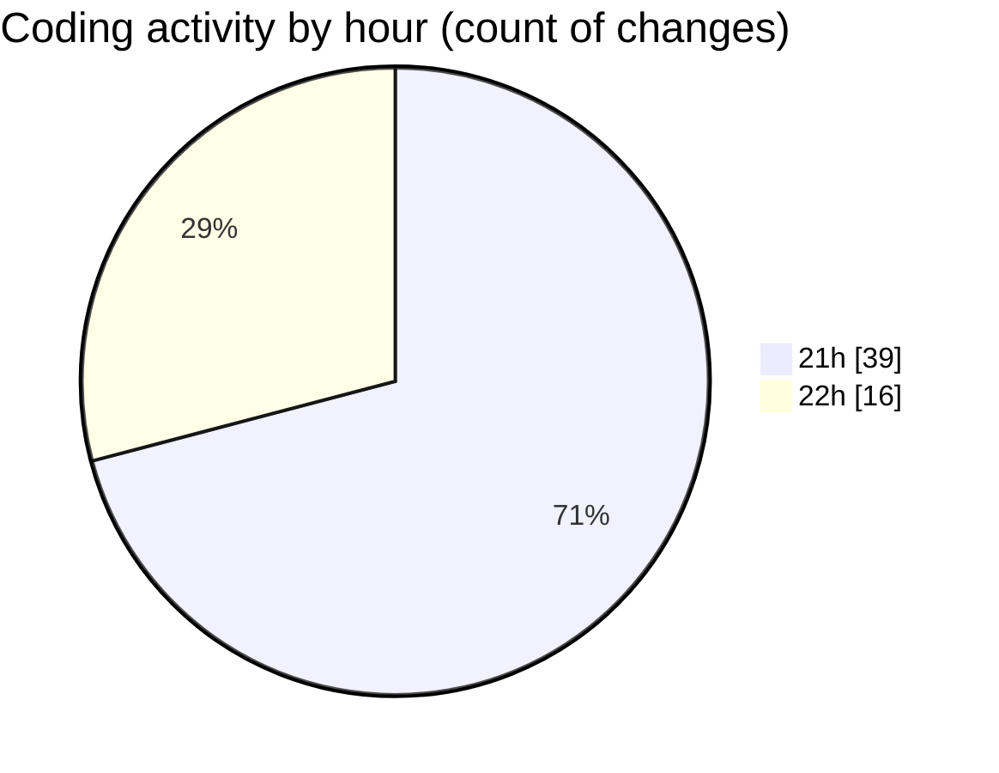

# date - Activity Summary 

## Overall Statistics

| Stat                   | Value                                                             |
| ---------------------- | ----------------------------------------------------------------- |
| **Lines Added** (➕)   | 240                                          |
| **Lines Removed** (➖) | 106                                        |
| **Net Change** (↕)    | 134                |
| **Active Time** (⌚)   | 61 minutes |

## Modified Files
- **formatter.hpp** (+65, -54)
- **cpp.json** (+156, -51)
- **formatter.cpp** (+5, -1)
- **parseFormat.hpp** (+11, -0)
- **parseFormat.cpp** (+3, -0)

## Visualizations

### By File Type (Lines Changed)

### By Hour (Estimated Activity Count)

> **Last Updated:** 4/29/2025, 10:08:06 PM