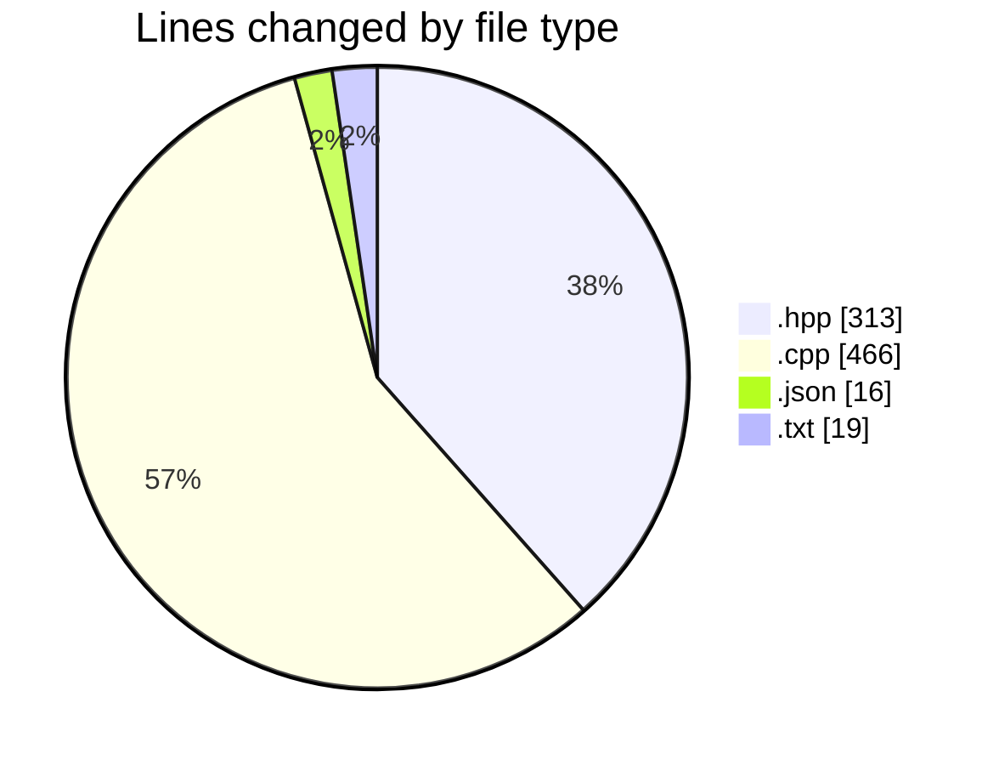
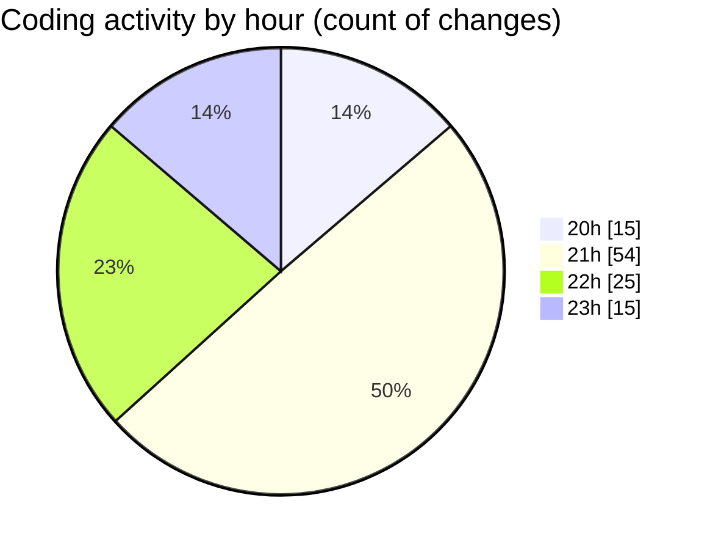

# date - Activity Summary 

## Overall Statistics

| Stat                   | Value                                                             |
| ---------------------- | ----------------------------------------------------------------- |
| **Lines Added** (➕)   | 782                                          |
| **Lines Removed** (➖) | 32                                        |
| **Net Change** (↕)    | 750                |
| **Active Time** (⌚)   | 131 minutes |

## Modified Files
- **day.hpp** (+61, -1)
- **month.cpp** (+17, -0)
- **main.cpp** (+359, -13)
- **month.hpp** (+155, -0)
- **launch.json** (+16, -0)
- **CMakeLists.txt** (+19, -0)
- **printer.cpp** (+31, -2)
- **printer.hpp** (+22, -7)
- **parser.hpp** (+16, -0)
- **parser.cpp** (+14, -2)
- **clock.hpp** (+44, -7)
- **clock.cpp** (+28, -0)

## Visualizations

### By File Type (Lines Changed)

### By Hour (Estimated Activity Count)

> **Last Updated:** 5/2/2025, 11:56:22 PM