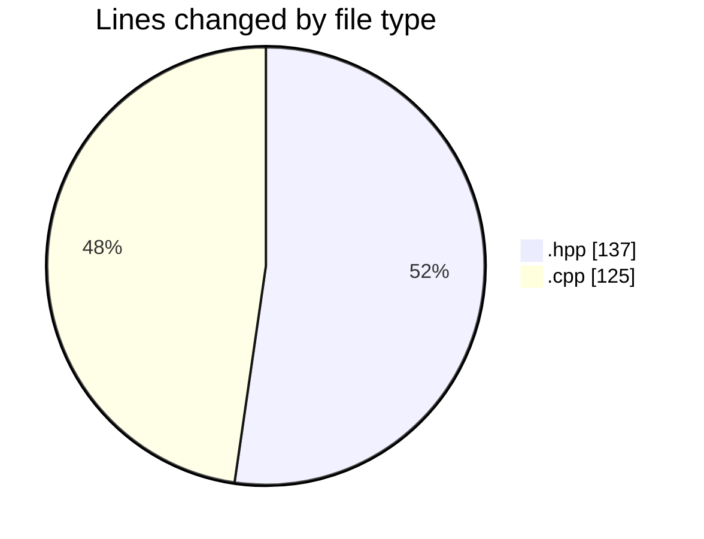
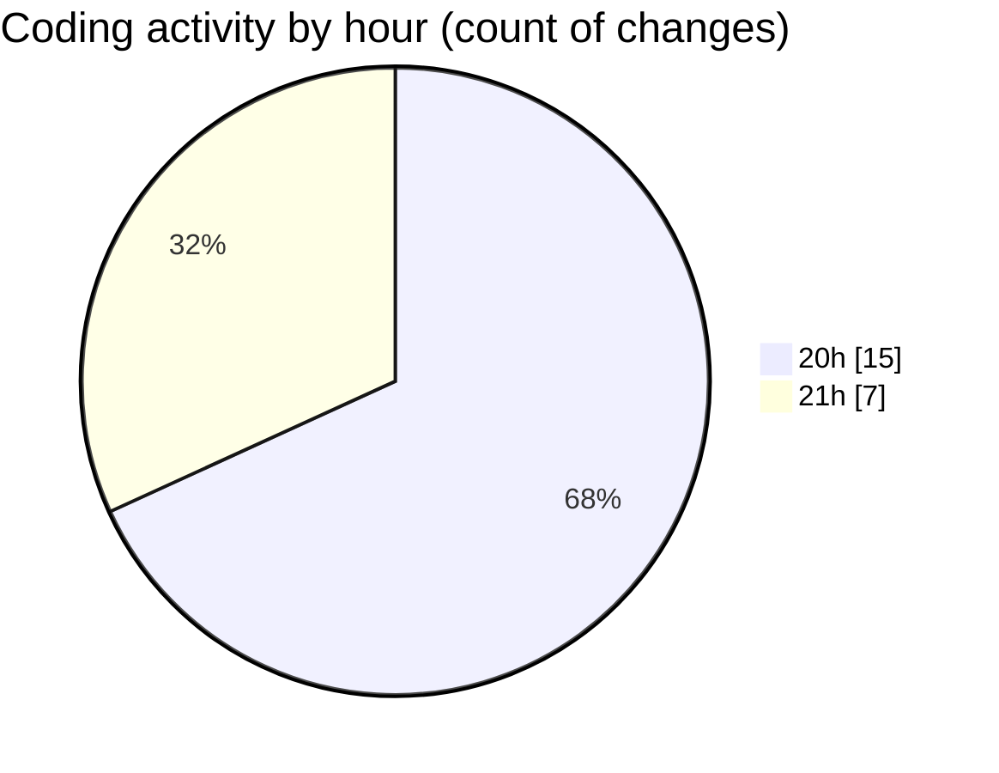

# date - Activity Summary 

## Overall Statistics

| Stat                   | Value                                                             |
| ---------------------- | ----------------------------------------------------------------- |
| **Lines Added** (➕)   | 261                                          |
| **Lines Removed** (➖) | 1                                        |
| **Net Change** (↕)    | 260                |
| **Active Time** (⌚)   | 31 minutes |

## Modified Files
- **day.hpp** (+61, -1)
- **month.cpp** (+17, -0)
- **main.cpp** (+108, -0)
- **month.hpp** (+75, -0)

## Visualizations

### By File Type (Lines Changed)

### By Hour (Estimated Activity Count)

> **Last Updated:** 5/2/2025, 9:05:29 PM