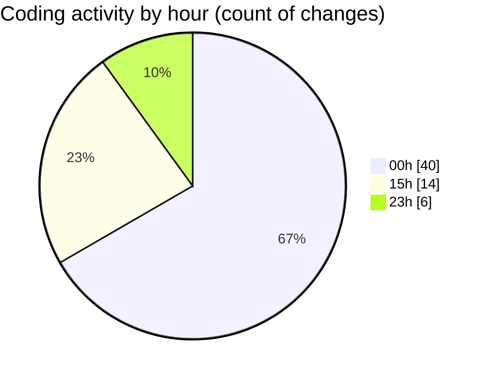

# date - Activity Summary 

## Overall Statistics

| Stat                   | Value                                                             |
| ---------------------- | ----------------------------------------------------------------- |
| **Lines Added** (➕)   | 488                                          |
| **Lines Removed** (➖) | 15                                        |
| **Net Change** (↕)    | 473                |
| **Active Time** (⌚)   | 71 minutes |

## Modified Files
- **day.hpp** (+62, -0)
- **month.hpp** (+82, -0)
- **main.cpp** (+130, -1)
- **printer.hpp** (+17, -0)
- **printer.cpp** (+40, -1)
- **clock.hpp** (+39, -4)
- **formatter.hpp** (+17, -1)
- **formatter.cpp** (+13, -1)
- **clock.cpp** (+88, -7)

## Visualizations

### By File Type (Lines Changed)

### By Hour (Estimated Activity Count)

> **Last Updated:** 5/3/2025, 3:45:22 PM