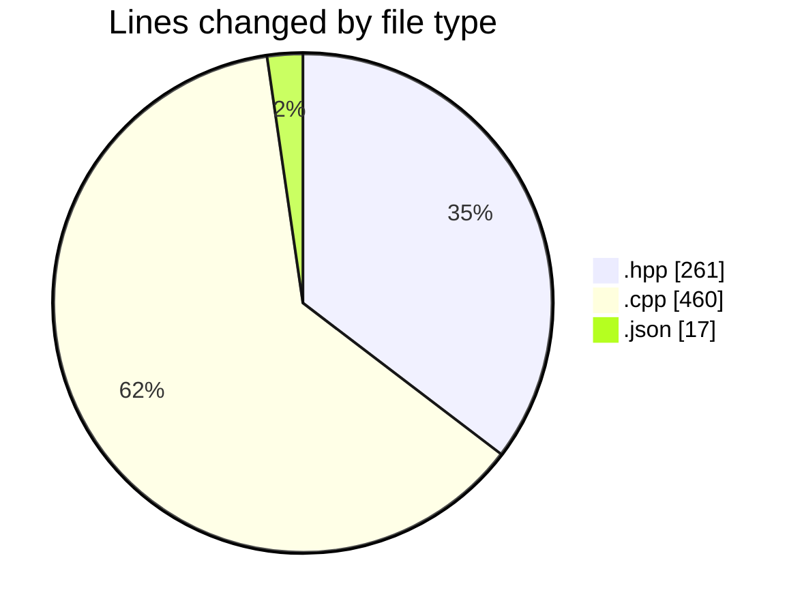
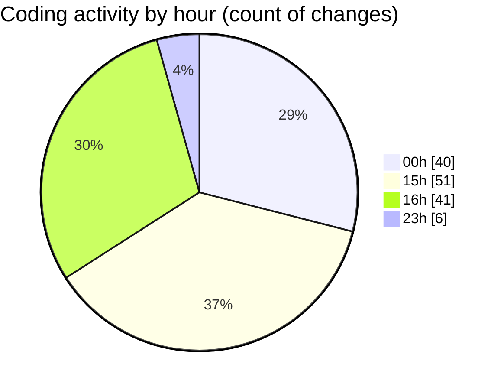

# date - Activity Summary 

## Overall Statistics

| Stat                   | Value                                                             |
| ---------------------- | ----------------------------------------------------------------- |
| **Lines Added** (➕)   | 656                                          |
| **Lines Removed** (➖) | 82                                        |
| **Net Change** (↕)    | 574                |
| **Active Time** (⌚)   | 161 minutes |

## Modified Files
- **day.hpp** (+62, -0)
- **month.hpp** (+82, -0)
- **main.cpp** (+138, -40)
- **printer.hpp** (+39, -0)
- **printer.cpp** (+103, -9)
- **clock.hpp** (+40, -4)
- **formatter.hpp** (+33, -1)
- **formatter.cpp** (+25, -1)
- **clock.cpp** (+117, -27)
- **launch.json** (+17, -0)

## Visualizations

### By File Type (Lines Changed)

### By Hour (Estimated Activity Count)

> **Last Updated:** 5/3/2025, 4:20:22 PM