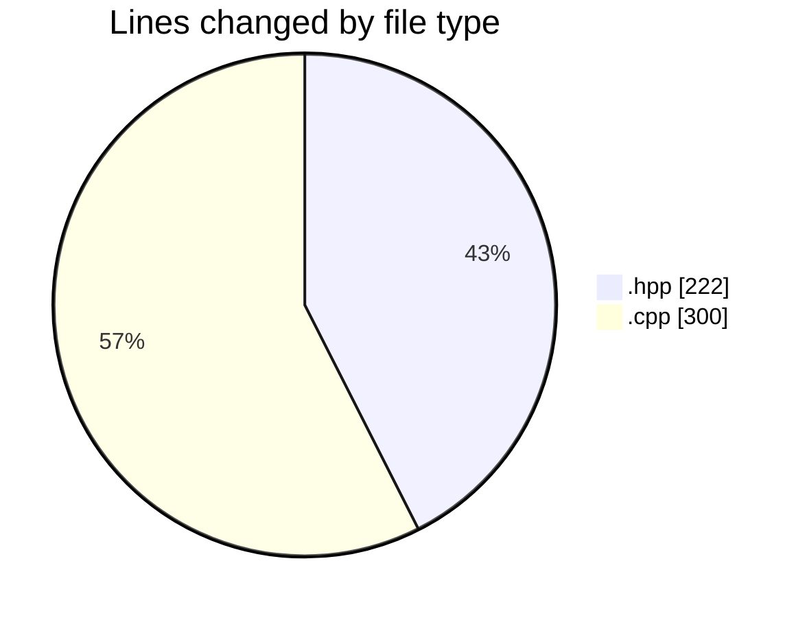
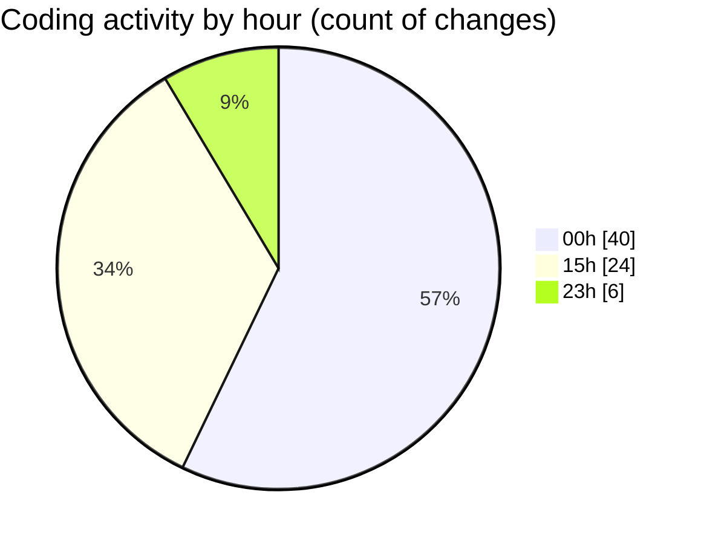

# date - Activity Summary 

## Overall Statistics

| Stat                   | Value                                                             |
| ---------------------- | ----------------------------------------------------------------- |
| **Lines Added** (➕)   | 498                                          |
| **Lines Removed** (➖) | 24                                        |
| **Net Change** (↕)    | 474                |
| **Active Time** (⌚)   | 82 minutes |

## Modified Files
- **day.hpp** (+62, -0)
- **month.hpp** (+82, -0)
- **main.cpp** (+132, -2)
- **printer.hpp** (+17, -0)
- **printer.cpp** (+40, -1)
- **clock.hpp** (+39, -4)
- **formatter.hpp** (+17, -1)
- **formatter.cpp** (+13, -1)
- **clock.cpp** (+96, -15)

## Visualizations

### By File Type (Lines Changed)

### By Hour (Estimated Activity Count)

> **Last Updated:** 5/3/2025, 3:50:22 PM