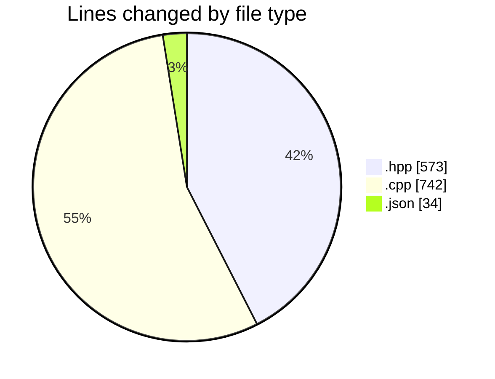
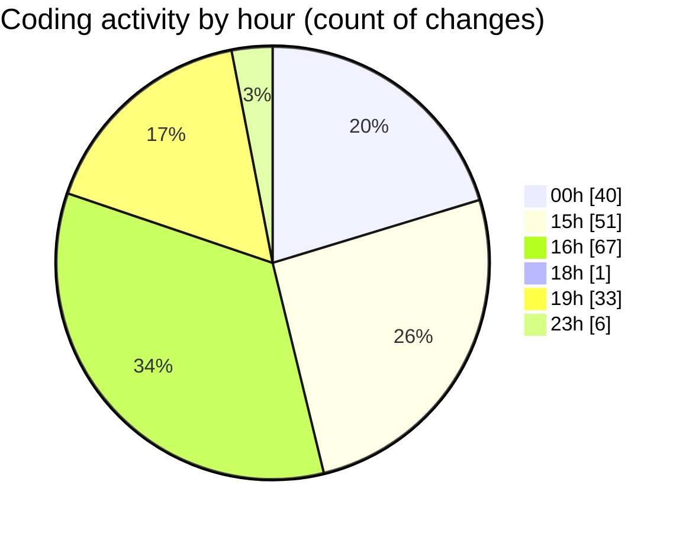

# date - Activity Summary 

## Overall Statistics

| Stat                   | Value                                                             |
| ---------------------- | ----------------------------------------------------------------- |
| **Lines Added** (➕)   | 1247                                          |
| **Lines Removed** (➖) | 102                                        |
| **Net Change** (↕)    | 1145                |
| **Active Time** (⌚)   | 226 minutes |

## Modified Files
- **day.hpp** (+149, -0)
- **month.hpp** (+189, -0)
- **main.cpp** (+228, -53)
- **printer.hpp** (+65, -0)
- **printer.cpp** (+140, -9)
- **clock.hpp** (+65, -4)
- **formatter.hpp** (+100, -1)
- **formatter.cpp** (+135, -8)
- **clock.cpp** (+142, -27)
- **launch.json** (+34, -0)

## Visualizations

### By File Type (Lines Changed)

### By Hour (Estimated Activity Count)

> **Last Updated:** 5/3/2025, 7:13:51 PM