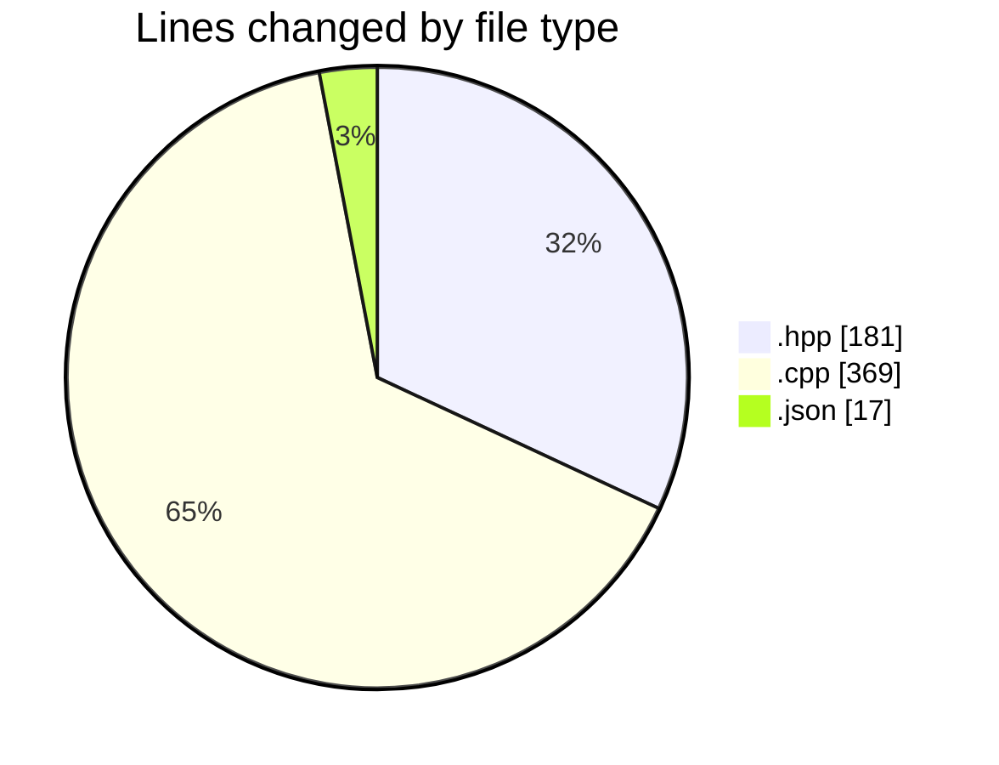
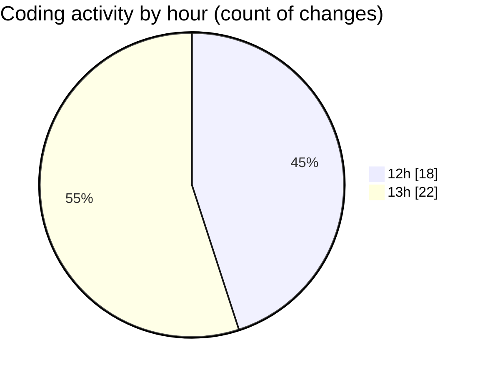

# date - Activity Summary 

## Overall Statistics

| Stat                   | Value                                                             |
| ---------------------- | ----------------------------------------------------------------- |
| **Lines Added** (➕)   | 526                                          |
| **Lines Removed** (➖) | 41                                        |
| **Net Change** (↕)    | 485                |
| **Active Time** (⌚)   | 48 minutes |

## Modified Files
- **formatter.hpp** (+44, -29)
- **formatter.cpp** (+71, -0)
- **format.hpp** (+14, -0)
- **main.cpp** (+90, -2)
- **parser.cpp** (+73, -1)
- **parser.hpp** (+44, -1)
- **printer.cpp** (+124, -8)
- **printer.hpp** (+49, -0)
- **launch.json** (+17, -0)

## Visualizations

### By File Type (Lines Changed)

### By Hour (Estimated Activity Count)

> **Last Updated:** 5/4/2025, 1:10:11 PM