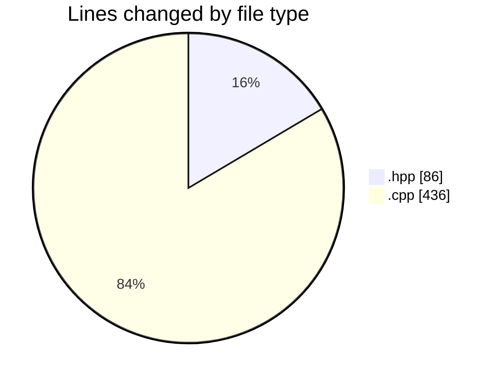
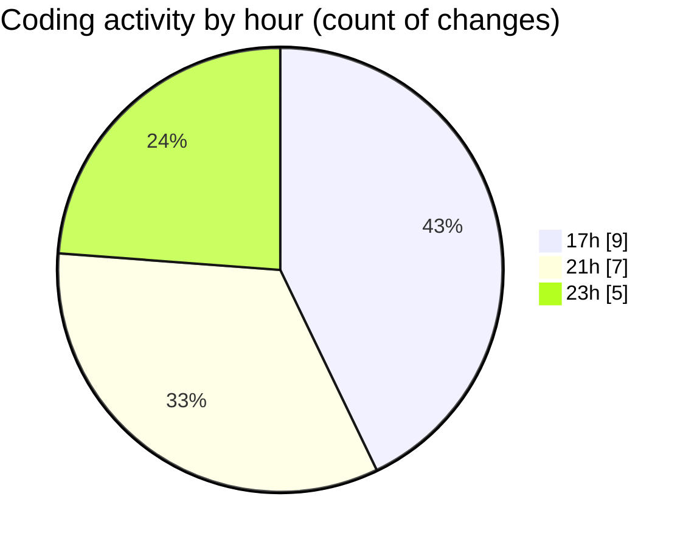

# date - Activity Summary 

## Overall Statistics

| Stat                   | Value                                                             |
| ---------------------- | ----------------------------------------------------------------- |
| **Lines Added** (➕)   | 514                                          |
| **Lines Removed** (➖) | 8                                        |
| **Net Change** (↕)    | 506                |
| **Active Time** (⌚)   | 22 minutes |

## Modified Files
- **parser.hpp** (+82, -4)
- **parser.cpp** (+157, -3)
- **main.cpp** (+173, -0)
- **clock.cpp** (+102, -1)

## Visualizations

### By File Type (Lines Changed)

### By Hour (Estimated Activity Count)

> **Last Updated:** 5/7/2025, 11:50:50 PM