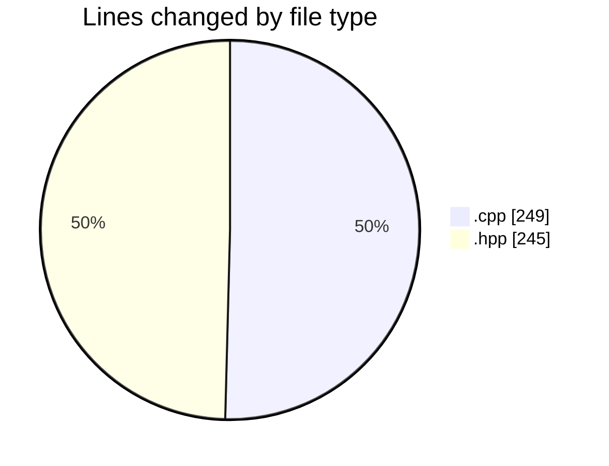

# date - Activity Summary 

## Overall Statistics

| Stat                   | Value                                                             |
| ---------------------- | ----------------------------------------------------------------- |
| **Lines Added** (➕)   | 476                                          |
| **Lines Removed** (➖) | 18                                        |
| **Net Change** (↕)    | 458                |
| **Active Time** (⌚)   | 45 minutes |

## Modified Files
- **clock.cpp** (+108, -5)
- **printer.cpp** (+135, -1)
- **day.hpp** (+126, -10)
- **month.hpp** (+107, -2)

## Visualizations

### By File Type (Lines Changed)

### By Hour (Estimated Activity Count)

> **Last Updated:** 5/8/2025, 8:49:46 PM