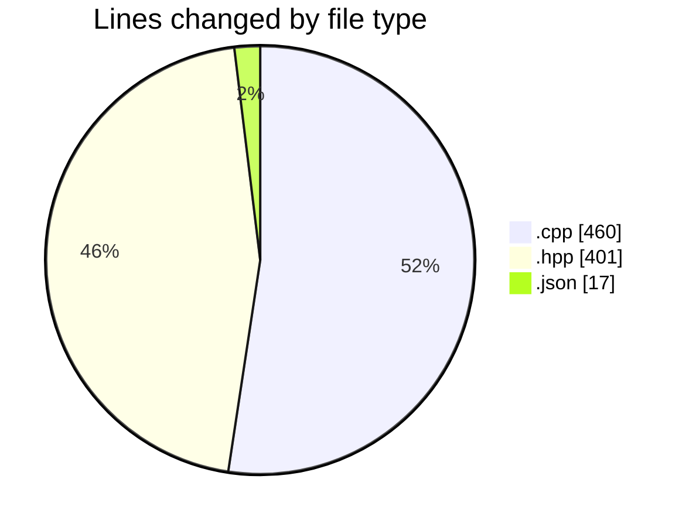
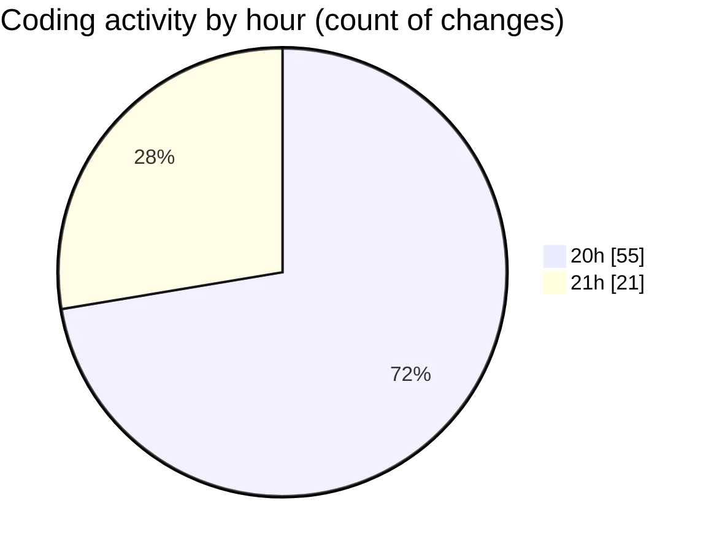

# date - Activity Summary 

## Overall Statistics

| Stat                   | Value                                                             |
| ---------------------- | ----------------------------------------------------------------- |
| **Lines Added** (➕)   | 835                                          |
| **Lines Removed** (➖) | 43                                        |
| **Net Change** (↕)    | 792                |
| **Active Time** (⌚)   | 99 minutes |

## Modified Files
- **clock.cpp** (+108, -5)
- **printer.cpp** (+144, -1)
- **day.hpp** (+126, -10)
- **month.hpp** (+163, -12)
- **main.cpp** (+89, -5)
- **printer.hpp** (+50, -0)
- **launch.json** (+17, -0)
- **parser.cpp** (+99, -9)
- **parser.hpp** (+39, -1)

## Visualizations

### By File Type (Lines Changed)

### By Hour (Estimated Activity Count)

> **Last Updated:** 5/8/2025, 9:19:46 PM