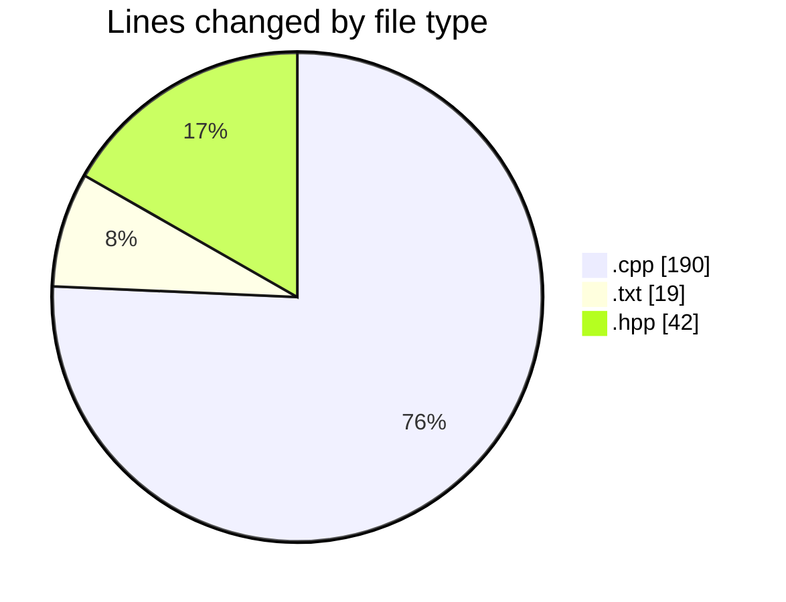
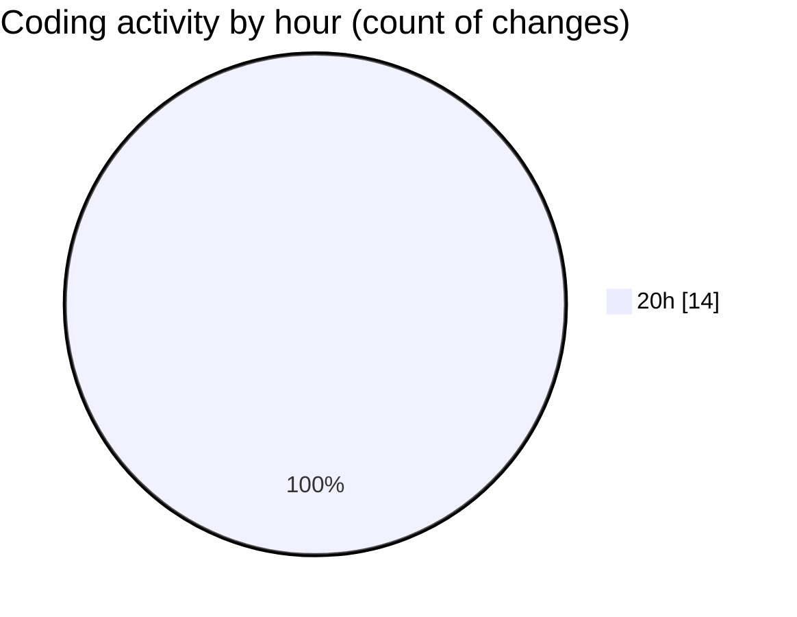

# date - Activity Summary 

## Overall Statistics

| Stat                   | Value                                                             |
| ---------------------- | ----------------------------------------------------------------- |
| **Lines Added** (➕)   | 245                                          |
| **Lines Removed** (➖) | 6                                        |
| **Net Change** (↕)    | 239                |
| **Active Time** (⌚)   | 18 minutes |

## Modified Files
- **main.cpp** (+89, -4)
- **CMakeLists.txt** (+19, -0)
- **parser.cpp** (+95, -2)
- **parser.hpp** (+42, -0)

## Visualizations

### By File Type (Lines Changed)

### By Hour (Estimated Activity Count)

> **Last Updated:** 5/9/2025, 8:52:36 PM