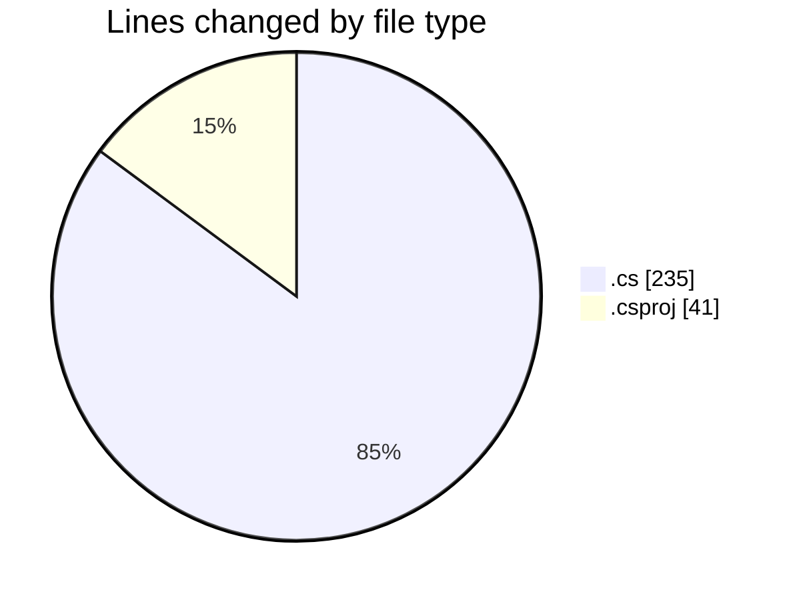
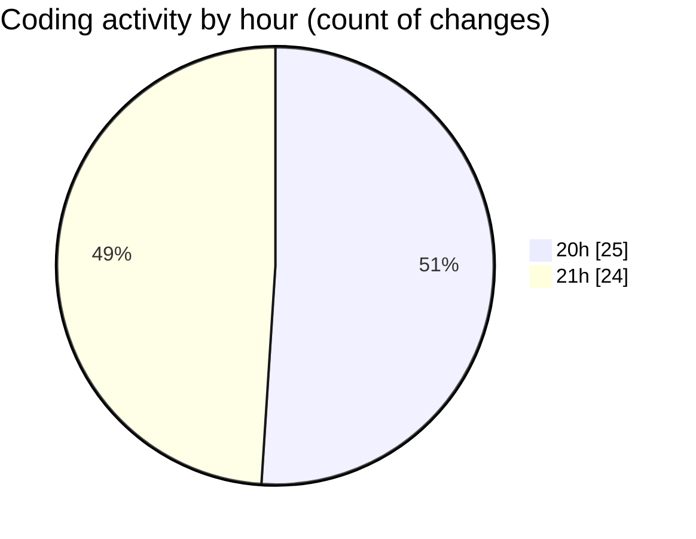

# SkinTrack - Activity Summary 

## Overall Statistics

| Stat                   | Value                                                             |
| ---------------------- | ----------------------------------------------------------------- |
| **Lines Added** (➕)   | 228                                          |
| **Lines Removed** (➖) | 48                                        |
| **Net Change** (↕)    | 180                |
| **Active Time** (⌚)   | 53 minutes |

## Modified Files
- **Program.cs** (+32, -5)
- **Database.cs** (+33, -4)
- **DbContext.cs** (+35, -0)
- **AppDbContext.cs** (+53, -33)
- **SkinTrack.csproj** (+35, -6)
- **Skin.cs** (+6, -0)
- **Competition.cs** (+6, -0)
- **Car.cs** (+5, -0)
- **DatabaseService.cs** (+23, -0)

## Visualizations

### By File Type (Lines Changed)

### By Hour (Estimated Activity Count)

> **Last Updated:** 10/7/2025, 9:08:43 PM