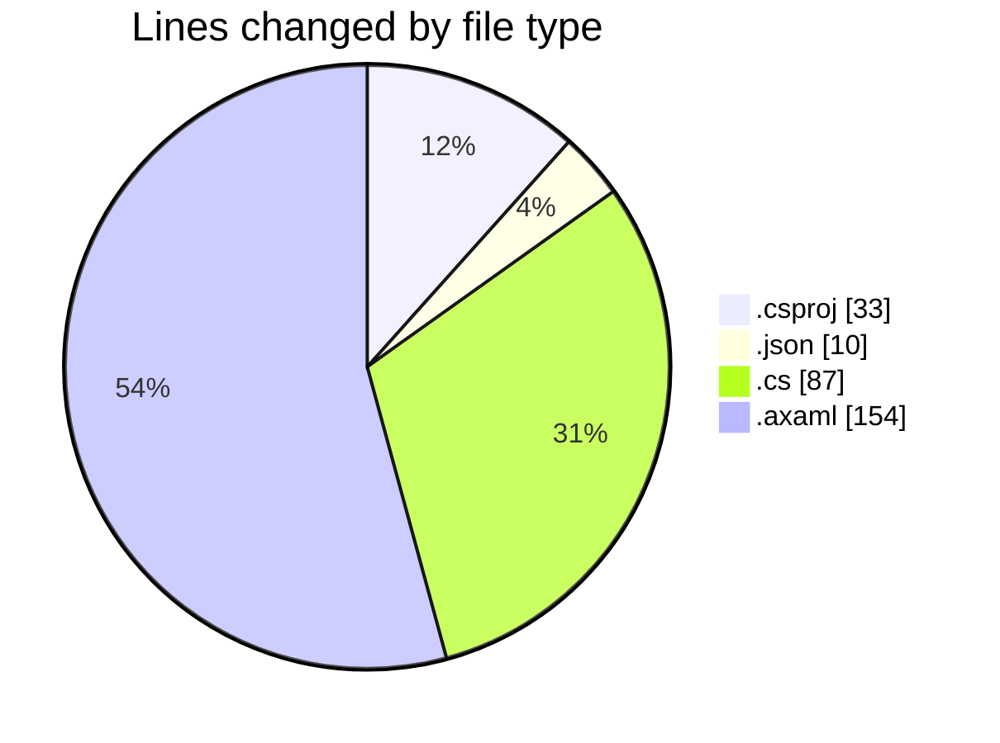
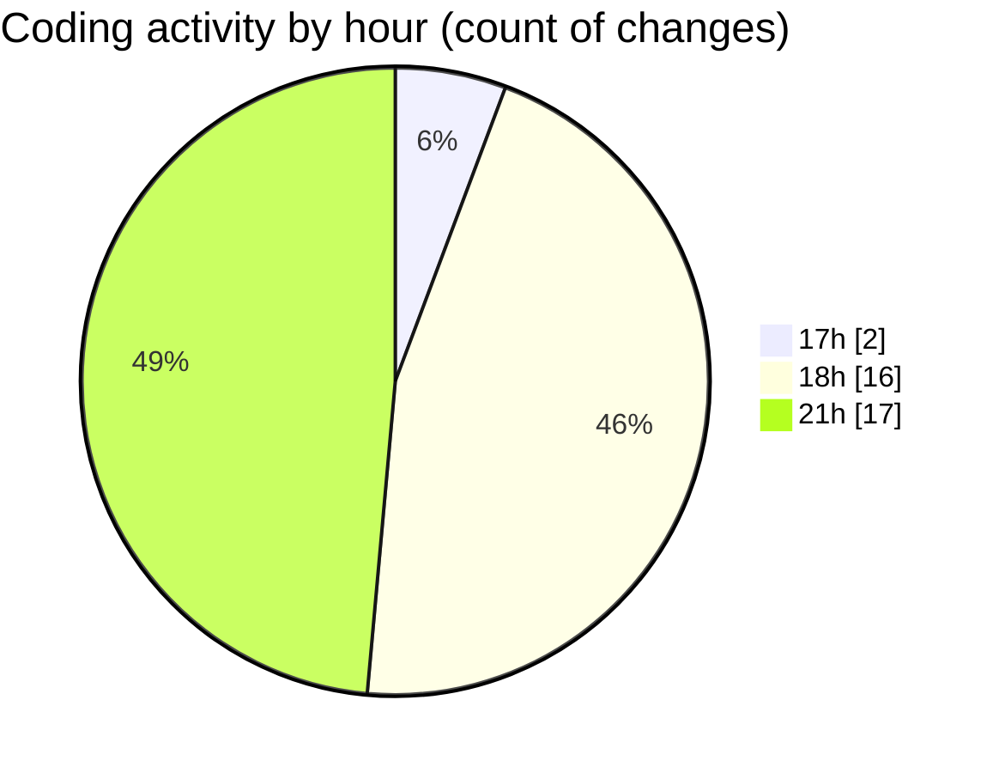

# SkinTrack - Activity Summary 

## Overall Statistics

| Stat                   | Value                                                             |
| ---------------------- | ----------------------------------------------------------------- |
| **Lines Added** (➕)   | 229                                          |
| **Lines Removed** (➖) | 55                                        |
| **Net Change** (↕)    | 174                |
| **Active Time** (⌚)   | 34 minutes |

## Modified Files
- **SkinTrack.csproj** (+33, -0)
- **settings.json** (+10, -0)
- **Program.cs** (+79, -8)
- **App.axaml** (+51, -36)
- **Main.axaml** (+21, -11)
- **Window1.axaml** (+12, -0)
- **MainWindow.axaml** (+23, -0)

## Visualizations

### By File Type (Lines Changed)

### By Hour (Estimated Activity Count)

> **Last Updated:** 10/13/2025, 9:57:09 PM