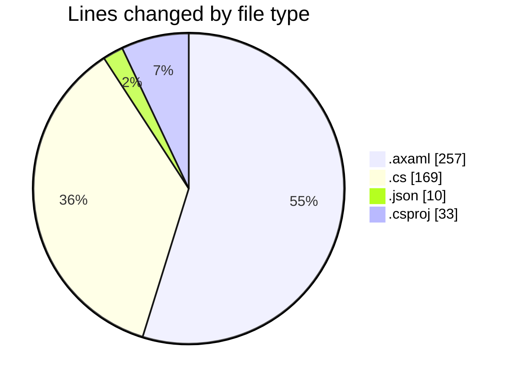
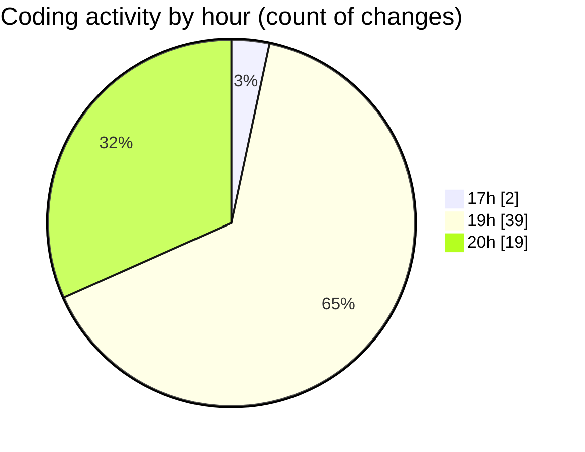

# SkinTrack - Activity Summary 

## Overall Statistics

| Stat                   | Value                                                             |
| ---------------------- | ----------------------------------------------------------------- |
| **Lines Added** (➕)   | 400                                          |
| **Lines Removed** (➖) | 69                                        |
| **Net Change** (↕)    | 331                |
| **Active Time** (⌚)   | 63 minutes |

## Modified Files
- **CarsView.axaml** (+30, -2)
- **HomeView.axaml** (+56, -11)
- **HomeView.axaml.cs** (+48, -15)
- **settings.json** (+10, -0)
- **SkinTrack.csproj** (+33, -0)
- **AppDbContext.cs** (+26, -0)
- **Program.cs** (+36, -0)
- **MainWindow.axaml.cs** (+41, -3)
- **MainWindow.axaml** (+120, -38)

## Visualizations

### By File Type (Lines Changed)

### By Hour (Estimated Activity Count)

> **Last Updated:** 10/21/2025, 8:06:41 PM