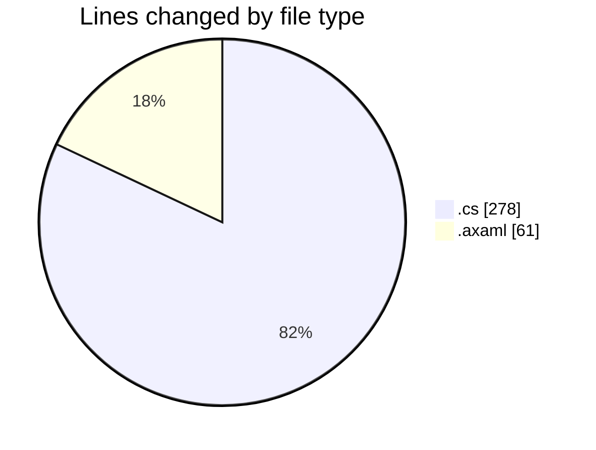
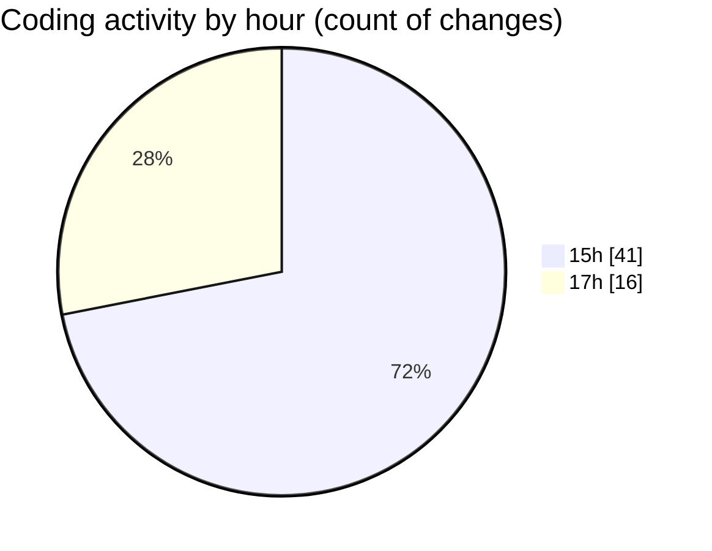

# SkinTrack - Activity Summary 

## Overall Statistics

| Stat                   | Value                                                             |
| ---------------------- | ----------------------------------------------------------------- |
| **Lines Added** (➕)   | 314                                          |
| **Lines Removed** (➖) | 25                                        |
| **Net Change** (↕)    | 289                |
| **Active Time** (⌚)   | 61 minutes |

## Modified Files
- **DatabaseService.cs** (+47, -13)
- **CarsViewModel.cs** (+16, -0)
- **CompetitionsViewModel.cs** (+18, -5)
- **SkinsViewModel.cs** (+15, -0)
- **MainWindowViewModel.cs** (+99, -7)
- **App.axaml.cs** (+34, -0)
- **MainWindow.axaml.cs** (+24, -0)
- **MainWindow.axaml** (+61, -0)

## Visualizations

### By File Type (Lines Changed)

### By Hour (Estimated Activity Count)

> **Last Updated:** 10/26/2025, 5:27:02 PM