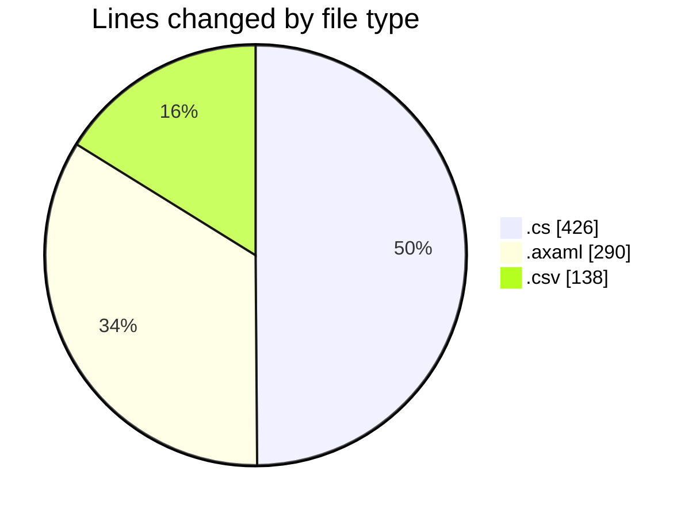
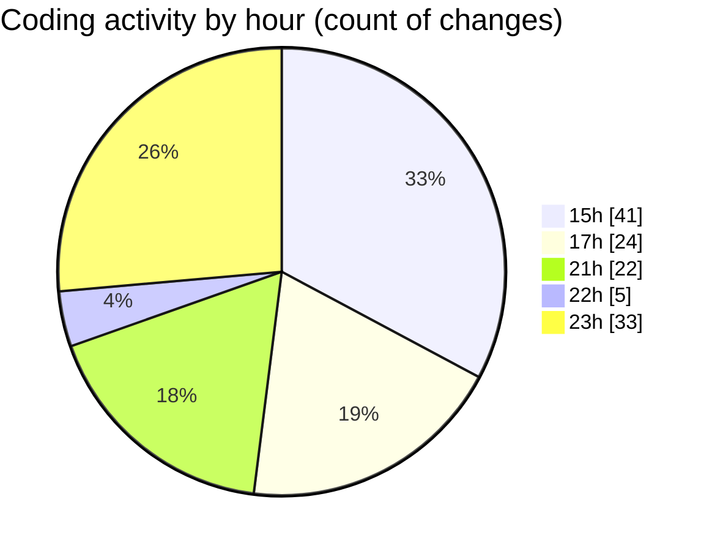

# SkinTrack - Activity Summary 

## Overall Statistics

| Stat                   | Value                                                             |
| ---------------------- | ----------------------------------------------------------------- |
| **Lines Added** (➕)   | 759                                          |
| **Lines Removed** (➖) | 95                                        |
| **Net Change** (↕)    | 664                |
| **Active Time** (⌚)   | 143 minutes |

## Modified Files
- **DatabaseService.cs** (+47, -13)
- **CarsViewModel.cs** (+16, -0)
- **CompetitionsViewModel.cs** (+18, -5)
- **SkinsViewModel.cs** (+15, -0)
- **MainWindowViewModel.cs** (+105, -8)
- **App.axaml.cs** (+34, -0)
- **MainWindow.axaml.cs** (+38, -14)
- **MainWindow.axaml** (+122, -1)
- **CarsView.axaml** (+78, -30)
- **App.axaml** (+28, -0)
- **CompetitionsView.axaml** (+27, -4)
- **Cars.csv** (+28, -6)
- **Competitions.csv** (+11, -0)
- **Skins.csv** (+93, -0)
- **Car.cs** (+23, -1)
- **Competition.cs** (+28, -8)
- **Skin.cs** (+48, -5)

## Visualizations

### By File Type (Lines Changed)

### By Hour (Estimated Activity Count)

> **Last Updated:** 10/26/2025, 11:14:32 PM